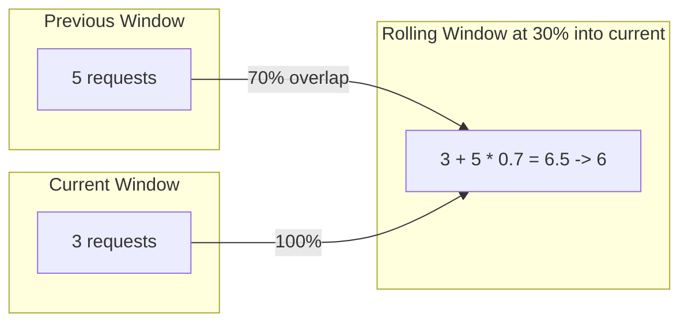
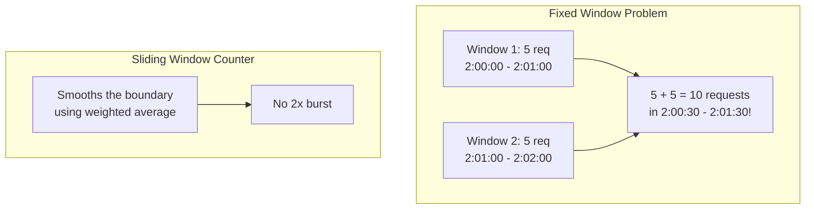

## Summary

The sliding window counter algorithm is a hybrid of fixed window counter and sliding window log. It estimates the request count in a rolling time window by combining the count from the current window with a weighted portion of the previous window's count. This approach is memory efficient (only stores two counters per window) while achieving approximately 99.997% accuracy, as validated by Cloudflare across 400 million requests.

## How It Works

### Formula

```
estimated_count = current_window_count + previous_window_count * overlap_percentage
```

Where `overlap_percentage = 1 - (elapsed_time_in_current_window / window_size)`

### Visual Example



**Example:** Max 7 requests/minute.
- Previous window: 5 requests
- Current window: 3 requests
- New request arrives at 30% into current window
- Overlap with previous: 70%
- Estimated: 3 + 5 * 0.7 = 6.5 (round down to 6)
- 6 < 7 limit, so request is **allowed**

### Comparison with Fixed Window



## When to Use

- When you need accurate rate limiting without high memory cost
- When fixed window's edge-burst problem is unacceptable
- When sliding window log's memory cost is too high
- General-purpose rate limiting where approximate accuracy suffices

## Trade-offs

| Benefit | Cost |
|---------|------|
| Memory efficient (2 counters per window) | Approximate, not exact |
| Smooths traffic spikes at window boundaries | Assumes even distribution in previous window |
| ~99.997% accuracy (per Cloudflare) | 0.003% of requests may be wrongly handled |
| Simple to implement | Slightly more complex than fixed window |

## Real-World Examples

- **Cloudflare:** Uses sliding window counter for rate limiting across millions of domains; validated with 400M requests showing only 0.003% error rate
- **Rate limiting libraries:** Many open-source implementations use this approach
- **Redis-based implementations:** Use two keys (current + previous window) with EXPIRE

## Common Pitfalls

- Using this for strict security enforcement where exact counting is required
- Forgetting to handle the edge case when there is no previous window data
- Not rounding consistently (decide upfront: round up = more strict, round down = more lenient)
- Implementing without atomic operations in a concurrent environment

## See Also

- [[rate-limiting-algorithms]] -- Comparison with all five algorithms
- [[token-bucket]] -- Alternative that handles bursts differently
- [[distributed-rate-limiting]] -- How to implement in multi-server environments
