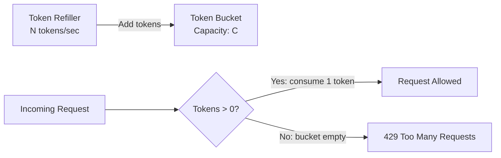
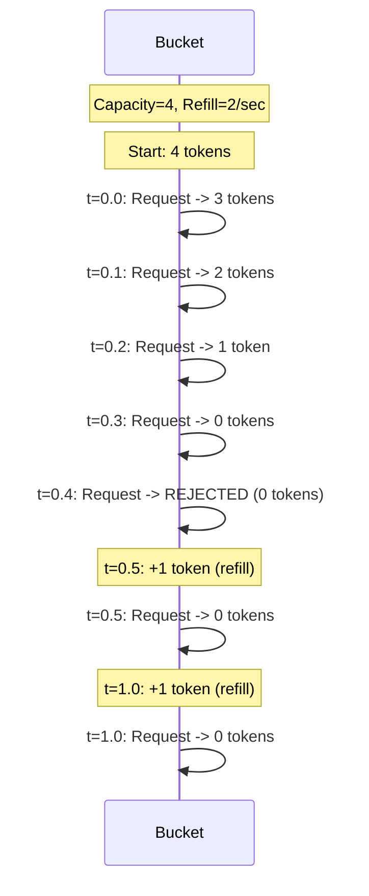

## Summary

The token bucket algorithm is the most widely used rate limiting approach. A bucket holds tokens up to a maximum capacity. Tokens are added at a fixed refill rate. Each request consumes one token; if no tokens remain, the request is rejected. The key advantage is that it naturally allows short bursts of traffic (up to the bucket capacity) while maintaining a long-term average rate equal to the refill rate. Amazon and Stripe both use this algorithm.

## How It Works

### Parameters

| Parameter | Description | Example |
|-----------|-------------|---------|
| **Bucket size** | Maximum tokens the bucket can hold | 10 tokens |
| **Refill rate** | Tokens added per time unit | 5 tokens/second |

### How Many Buckets?

| Scenario | Buckets Needed |
|----------|---------------|
| Different limits per API endpoint | 1 bucket per endpoint per user |
| Throttle by IP address | 1 bucket per IP |
| Global system limit | 1 shared bucket |
| Per-user multi-endpoint | 3+ buckets per user (post, friend, like) |

### Step-by-Step Example

## When to Use

- When short bursts of traffic should be allowed (e.g., page load triggers multiple API calls)
- When simplicity of implementation is important
- When memory efficiency matters (only 2 parameters per bucket)
- General-purpose rate limiting for APIs

## Trade-offs

| Benefit | Cost |
|---------|------|
| Simple to implement | Tuning bucket size and refill rate requires experimentation |
| Memory efficient (2 values per bucket) | Burst handling may be undesirable in some cases |
| Allows natural traffic bursts | Burst size equals bucket capacity (may be too large) |
| Well-understood, widely adopted | Does not guarantee smooth output rate |

## Real-World Examples

- **Amazon API Gateway:** Uses token bucket with configurable burst and rate
- **Stripe API:** Token bucket rate limiter for all API endpoints
- **Google Cloud:** Token bucket for API rate limiting
- **AWS Lambda:** Concurrency throttling uses a token-bucket-like model

## Common Pitfalls

- Setting bucket size too large (allows excessive bursts that overwhelm downstream)
- Setting refill rate without considering sustained traffic patterns
- Not having separate buckets for different API endpoints (all endpoints share one limit)
- Forgetting that an empty bucket blocks all requests until the next refill

## See Also

- [[rate-limiting-algorithms]] -- Comparison with all five algorithms
- [[sliding-window-counter]] -- Alternative with better accuracy at window boundaries
- [[distributed-rate-limiting]] -- Token bucket challenges in distributed systems
