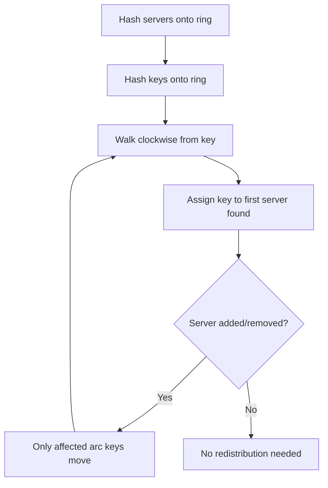

## Summary

Consistent hashing is a distributed hashing technique where adding or removing a node only requires remapping **k/n** keys on average (where k = total keys, n = number of nodes). This is achieved by placing both servers and keys on a circular hash space (hash ring) and assigning each key to the nearest server clockwise.

## How It Works

1. Use a uniform hash function (e.g., SHA-1) to map servers onto a ring `[0, 2^160)`
2. Map keys onto the same ring
3. For each key, walk clockwise to find the owning server
4. When a server is added, only keys between the new server and its predecessor move
5. When a server is removed, only its keys move to the next server clockwise
6. Use **virtual nodes** to achieve uniform distribution

## When to Use

- Distributed caching systems that scale dynamically
- Data partitioning in distributed databases (DynamoDB, Cassandra)
- Load balancing across web servers or microservices
- Content delivery networks (CDN) for routing to edge servers
- Any scenario where nodes join/leave frequently

## Trade-offs

| Aspect | Benefit | Cost |
|---|---|---|
| Minimal redistribution | Only k/n keys move on topology change | Ring management complexity |
| Horizontal scalability | Add nodes without full rehash | Need virtual nodes for balance |
| Decentralized | No central routing authority needed | Each node needs ring state |
| Heterogeneous capacity | Virtual nodes proportional to capacity | More metadata to manage |

## Real-World Examples

- **Amazon DynamoDB**: partitioning component uses consistent hashing
- **Apache Cassandra**: distributes data across cluster nodes
- **Discord**: routes chat sessions to Elixir processes
- **Akamai CDN**: maps content to edge servers
- **Google Maglev**: software network load balancer

## Common Pitfalls

- Deploying without virtual nodes, leading to severe load imbalance
- Choosing too few virtual nodes (< 100), resulting in > 10% load variance
- Not placing replicas in distinct data centers when using for replication
- Ignoring the memory cost of virtual node metadata at very high vnode counts

## See Also

- [[hash-ring]] -- the underlying circular data structure
- [[virtual-nodes]] -- the technique that makes distribution uniform
- [[key-redistribution]] -- what happens when servers change
- [[rehashing-problem]] -- the problem consistent hashing solves
- [[data-partitioning]] -- using consistent hashing for KV store partitioning
