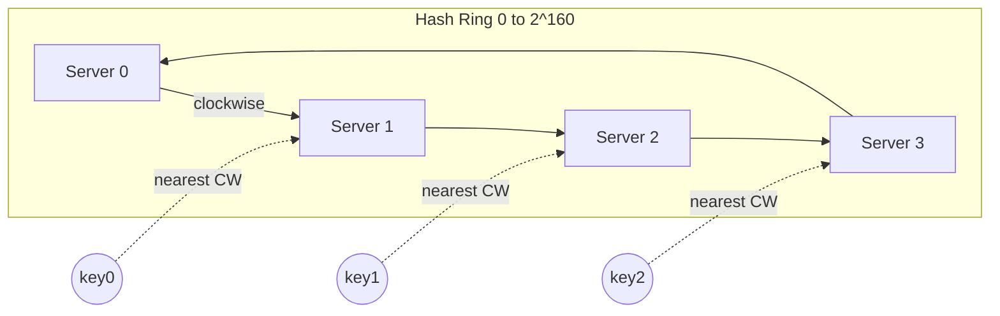

## Summary

A hash ring is a circular hash space where both servers and keys are mapped using the same hash function. The circular topology (connecting the end of the hash space back to the beginning) allows keys to be assigned to the nearest server found by walking clockwise, enabling consistent hashing.

## How It Works

1. Choose a hash function (e.g., SHA-1) with output range `[0, 2^160 - 1]`
2. Connect the ends to form a circle: position `2^160 - 1` wraps to `0`
3. Hash each server's IP/name to place it on the ring
4. Hash each key to place it on the ring
5. Each key is assigned to the **first server encountered clockwise**
6. When a server is added/removed, only keys in the affected arc move

## When to Use

- Distributed caching (Memcached, Redis cluster)
- Data partitioning in distributed databases
- Load balancing across a dynamic set of servers
- Any system that needs to route requests to a changing set of nodes

## Trade-offs

| Aspect | Benefit | Cost |
|---|---|---|
| Circular topology | Elegant wraparound, no edge cases | Slightly more complex than linear |
| SHA-1 hash function | Uniform distribution, large space | Cryptographic overhead |
| Server placement by hash | Automatic, deterministic | May cluster if few servers |
| Key assignment by clockwise walk | O(log n) lookup with sorted structure | Requires maintaining sorted ring |

## Real-World Examples

- **Amazon DynamoDB** uses a hash ring for partitioning data across nodes
- **Apache Cassandra** places nodes and data on a ring using consistent hashing
- **Akamai CDN** routes content requests using a hash ring
- **Discord** uses consistent hashing for distributing chat sessions

## Common Pitfalls

- Using a hash function with poor uniformity, causing server clustering
- Forgetting that with few servers, partitions can be very uneven (need virtual nodes)
- Not handling the wrap-around case in implementation
- Confusing the key hash function with the server hash function

## See Also

- [[consistent-hashing]] -- the algorithm that uses the hash ring
- [[virtual-nodes]] -- solving uneven partition sizes on the ring
- [[rehashing-problem]] -- the problem that hash rings solve
