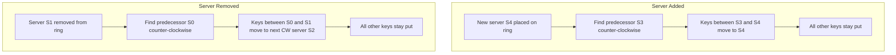

## Summary

When a server is added to or removed from a consistent hash ring, only the keys in the affected arc need to be redistributed. The affected arc is the range between the changed node and its counter-clockwise predecessor. This minimal redistribution is the core advantage of consistent hashing over modular hashing.

## How It Works

1. **Adding a server**: Walk counter-clockwise from the new node to find the predecessor. Keys in that arc move to the new node.
2. **Removing a server**: Walk counter-clockwise from the removed node to find the predecessor. Keys in that arc move to the next clockwise server.
3. With N servers, adding or removing one affects approximately **1/N** of the keyspace.
4. With virtual nodes, the affected keys are spread across multiple small arcs (one per virtual node), making the redistribution even smoother.

## When to Use

- Auto-scaling events (adding servers under load, removing idle servers)
- Failure recovery (server goes down, its keys redistribute)
- Capacity planning (adding nodes to a growing cluster)
- Rolling deployments where servers are replaced one at a time

## Trade-offs

| Aspect | Benefit | Cost |
|---|---|---|
| Minimal key movement | Only ~1/N of keys move | Still requires data transfer |
| Predictable affected range | Easy to identify which keys move | Must track ring topology |
| Virtual nodes smooth redistribution | Even smaller granularity | More arcs to process |
| Replication interaction | Replicas may already have the data | Must update replication chain |

## Real-World Examples

- **Cassandra** rebalances token ranges when nodes join/leave the ring
- **DynamoDB** automatically redistributes partitions on scaling events
- **Redis Cluster** uses hash slots (similar concept) and migrates slots on resharding
- **Ceph CRUSH** algorithm redistributes placement groups when OSDs change

## Common Pitfalls

- Not pre-warming caches after redistribution, causing a temporary load spike
- Forgetting that redistribution requires network transfer of actual data, not just metadata
- Adding multiple servers simultaneously, causing more redistribution than expected
- Not accounting for replication -- the replication chain also shifts when the ring changes

## See Also

- [[consistent-hashing]] -- the algorithm governing redistribution
- [[hash-ring]] -- the data structure where redistribution occurs
- [[virtual-nodes]] -- makes redistribution more granular and even
- [[rehashing-problem]] -- what happens without consistent hashing
