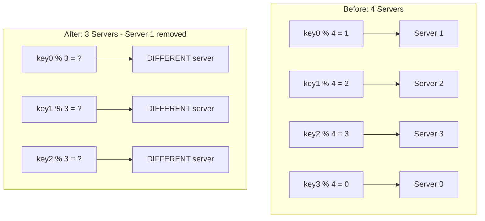

## Summary

The rehashing problem occurs when a simple modular hash function (`hash(key) % N`) is used to distribute keys across N servers. When N changes (server added or removed), nearly all keys are remapped to different servers, causing massive cache misses and potential system instability.

## How It Works

1. With N servers, each key is assigned via `hash(key) % N`
2. When a server is added or removed, N changes
3. `hash(key) % (N-1)` produces different results for most keys
4. Approximately 75% of keys get remapped when going from 4 to 3 servers
5. This triggers a **cache miss storm** as clients request keys from wrong servers

## When to Use

You should **avoid** modular hashing when:
- Server count is expected to change (scaling up/down)
- Cache consistency matters (e.g., CDN, distributed cache)
- The system needs high availability during topology changes

Modular hashing is acceptable when:
- Server count is truly fixed and never changes
- Cache misses are tolerable (e.g., low-traffic internal tool)

## Trade-offs

| Aspect | Modular Hashing | Consistent Hashing |
|---|---|---|
| Simplicity | Very simple (`% N`) | More complex (ring + virtual nodes) |
| Key redistribution on change | ~(N-1)/N keys move | ~k/n keys move |
| Memory overhead | None | Hash ring metadata |
| Implementation | One line of code | Requires sorted data structure |

## Real-World Examples

- **Memcached** early deployments used modular hashing and suffered cache miss storms during scaling events
- **Database sharding** with modular hash requires full resharding when adding nodes
- Any system using `hash % server_count` for routing hits this problem at scale

## Common Pitfalls

- Assuming server count will never change (it always does in production)
- Not measuring the cache miss rate after a topology change
- Overlooking the thundering herd effect when all caches invalidate simultaneously
- Using modular hashing "temporarily" and never migrating to consistent hashing

## See Also

- [[consistent-hashing]] -- the standard solution to the rehashing problem
- [[hash-ring]] -- the data structure that makes consistent hashing work
- [[virtual-nodes]] -- how to make consistent hashing evenly balanced
