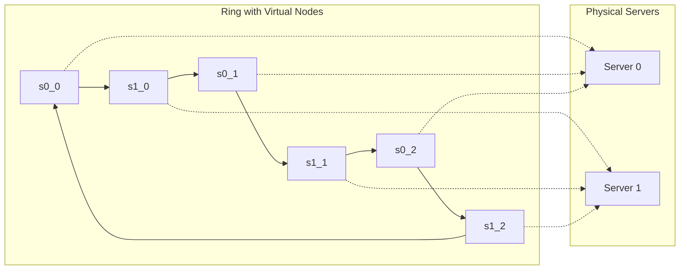

## Summary

Virtual nodes (vnodes) are multiple points on the hash ring that all map back to the same physical server. Instead of each server appearing once on the ring, it appears V times (e.g., `s0_0, s0_1, ..., s0_V`). This dramatically improves load distribution by reducing the variance in partition sizes.

## How It Works

1. For each physical server, create V virtual node identifiers (e.g., `server0_0`, `server0_1`, etc.)
2. Hash each virtual node identifier onto the ring
3. Key lookup works the same: walk clockwise, find first virtual node, map to physical server
4. More virtual nodes = more interleaving = more uniform distribution
5. Standard deviation of load decreases as approximately `1/sqrt(V)`

## When to Use

- Always use virtual nodes with consistent hashing in production systems
- When servers have different capacities (assign more vnodes to larger servers)
- When you need predictable, even load distribution
- When the number of physical servers is small (< 20), making basic consistent hashing highly uneven

## Trade-offs

| Virtual Node Count | Distribution Quality | Memory Cost |
|---|---|---|
| 1 (no vnodes) | Very uneven, high variance | Minimal |
| 10 | Still noticeable imbalance (~30% std dev) | Low |
| 100 | Good balance (~10% std dev) | Moderate |
| 200 | Very good balance (~5% std dev) | Higher |
| 500+ | Near-perfect balance | Significant metadata |

## Real-World Examples

- **Apache Cassandra** uses 256 virtual nodes per physical node by default
- **Amazon DynamoDB** uses virtual nodes to handle heterogeneous instance sizes
- **Riak** distributes data using a configurable number of vnodes (default 64)
- **Akka Cluster** uses virtual nodes for actor distribution

## Common Pitfalls

- Setting vnode count too low (< 50) and wondering why load is uneven
- Not adjusting vnode count proportionally to server capacity
- Forgetting that adding vnodes increases the ring metadata that each node must store
- Changing vnode count on a live system without understanding the redistribution impact

## See Also

- [[consistent-hashing]] -- the algorithm that virtual nodes enhance
- [[hash-ring]] -- the ring where virtual nodes are placed
- [[key-redistribution]] -- how keys move when vnodes change
