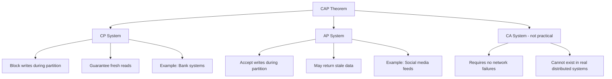

## Summary

The CAP theorem states that a distributed system can simultaneously guarantee at most two of three properties: **Consistency** (all nodes see the same data), **Availability** (every request gets a response), and **Partition Tolerance** (the system works despite network splits). Since network partitions are unavoidable in practice, the real choice is between CP (consistency + partition tolerance) and AP (availability + partition tolerance).

## How It Works

1. **Consistency**: Every read receives the most recent write or an error
2. **Availability**: Every request receives a non-error response (possibly stale)
3. **Partition Tolerance**: The system continues operating despite network splits between nodes
4. When a partition occurs, the system must choose: block operations (CP) or serve potentially stale data (AP)
5. CA systems assume no partitions and cannot exist in real-world distributed deployments

## When to Use

- **Choose CP** when correctness is critical: banking, inventory systems, distributed locks
- **Choose AP** when availability matters more: social feeds, DNS, shopping carts
- The decision should be per-feature, not per-system (e.g., payment = CP, product catalog = AP)

## Trade-offs

| Property | CP System | AP System |
|---|---|---|
| During partition | Returns errors or blocks | Returns stale data |
| Consistency guarantee | Strong (linearizable) | Eventual |
| User experience | May see errors | May see outdated info |
| Write availability | Blocked if quorum unreachable | Always accepting writes |
| Reconciliation | Not needed (writes blocked) | Required after partition heals |

## Real-World Examples

- **CP**: Google Spanner (strong consistency via TrueTime), HBase, MongoDB (default config)
- **AP**: Amazon DynamoDB (eventual consistency mode), Cassandra, CouchDB, DNS
- **Tunable**: DynamoDB and Cassandra let you choose per-query (strong vs eventual reads)

## Common Pitfalls

- Thinking CA is a real option for distributed systems (network partitions always happen)
- Treating CAP as binary -- many systems offer tunable consistency along a spectrum
- Confusing partition tolerance with fault tolerance (they overlap but are not identical)
- Ignoring that the choice can (and should) be different for different parts of the same system

## See Also

- [[quorum-consensus]] -- the mechanism for tuning consistency vs availability
- [[data-replication]] -- why partition tolerance matters for replicated data
- [[vector-clocks]] -- resolving conflicts in AP systems
