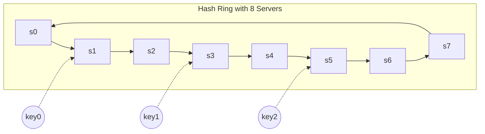

## Summary

Data partitioning splits a large dataset across multiple servers so no single machine must hold everything. In a distributed key-value store, consistent hashing is used to assign keys to servers on a hash ring, providing automatic scaling and minimal data movement when nodes change. Virtual nodes allow heterogeneous server capacities.

## How It Works

1. Place servers on a consistent hash ring
2. Hash each key onto the same ring
3. Walk clockwise from the key's position to find the owning server
4. Use virtual nodes so higher-capacity servers own proportionally more of the ring
5. When a server is added or removed, only keys in the affected arc are redistributed

## When to Use

- Any dataset too large for a single server
- Systems that need to scale horizontally by adding nodes
- Workloads requiring even distribution across heterogeneous hardware
- When you need automatic rebalancing on topology changes

## Trade-offs

| Aspect | Benefit | Cost |
|---|---|---|
| Consistent hashing | Minimal key movement on changes | Ring management overhead |
| Virtual nodes | Proportional to server capacity | Memory for vnode metadata |
| Automatic scaling | Servers added/removed transparently | Redistribution network cost |
| Even distribution | No single hot server | Requires enough vnodes |

## Real-World Examples

- **DynamoDB** partitions data across storage nodes using consistent hashing
- **Cassandra** distributes rows across the cluster via token ring partitioning
- **Riak** uses consistent hashing with configurable vnodes for partitioning
- **Redis Cluster** uses 16384 hash slots (a simplified form of partitioning)

## Common Pitfalls

- Partitioning without replication -- a single node failure loses data
- Not accounting for hot keys that concentrate load regardless of partitioning
- Using too few virtual nodes, causing uneven partition sizes
- Forgetting to co-locate related data (e.g., user profile and user posts)

## See Also

- [[consistent-hashing]] -- the algorithm behind data partitioning
- [[virtual-nodes]] -- ensuring even partition sizes
- [[data-replication]] -- replicating partitioned data for fault tolerance
- [[cap-theorem]] -- the trade-offs inherent in distributed partitioned systems
