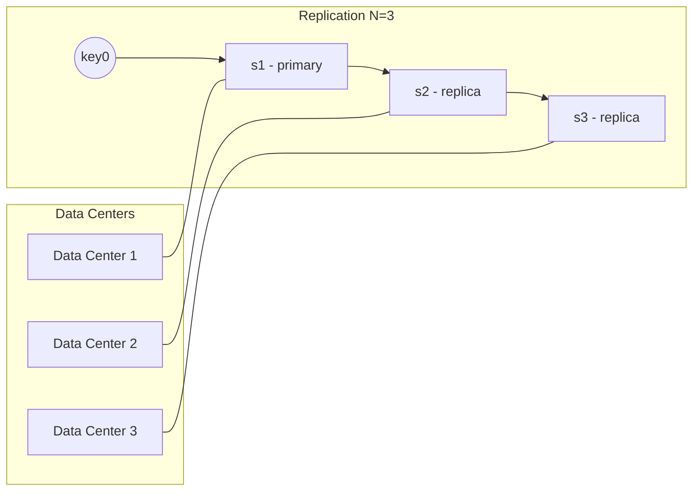

## Summary

Data replication copies each key-value pair to N servers for high availability and durability. After mapping a key to a position on the hash ring, the system walks clockwise and selects the first N unique physical servers as replicas. Replicas should be placed in distinct data centers to survive regional failures.

## How It Works

1. Map the key to the hash ring to find its primary server
2. Walk clockwise and pick the next N-1 unique physical servers as replicas
3. With virtual nodes, skip virtual nodes belonging to the same physical server
4. Place replicas in distinct data centers connected by high-speed networks
5. Writes are replicated asynchronously (AP) or synchronously (CP) depending on configuration

## When to Use

- Any system requiring high availability (survive node or datacenter failures)
- Data that cannot be regenerated or is expensive to regenerate
- Systems with SLAs requiring 99.99%+ uptime
- Geographically distributed systems needing local read access

## Trade-offs

| Aspect | Benefit | Cost |
|---|---|---|
| More replicas (higher N) | Better durability and availability | More storage, write amplification |
| Cross-datacenter replicas | Survive regional failures | Higher write latency |
| Asynchronous replication | Low write latency | Possible stale reads |
| Synchronous replication | Strong consistency | Higher write latency, lower availability |

## Real-World Examples

- **DynamoDB** replicates data across three facilities within a region
- **Cassandra** uses a configurable replication factor and replication strategy (simple or network-topology)
- **MongoDB** replica sets maintain copies across nodes with automatic failover
- **Google Spanner** replicates across continents with synchronous writes

## Common Pitfalls

- Placing all replicas in the same data center (single point of failure for the whole DC)
- Setting replication factor too low (N=1 means any node failure loses data)
- Ignoring the interaction between virtual nodes and physical server uniqueness
- Not considering that write amplification scales linearly with N

## See Also

- [[data-partitioning]] -- how data is distributed before replication
- [[quorum-consensus]] -- coordinating reads/writes across replicas
- [[cap-theorem]] -- the consistency/availability trade-off for replicated data
- [[gossip-protocol]] -- detecting replica failures
