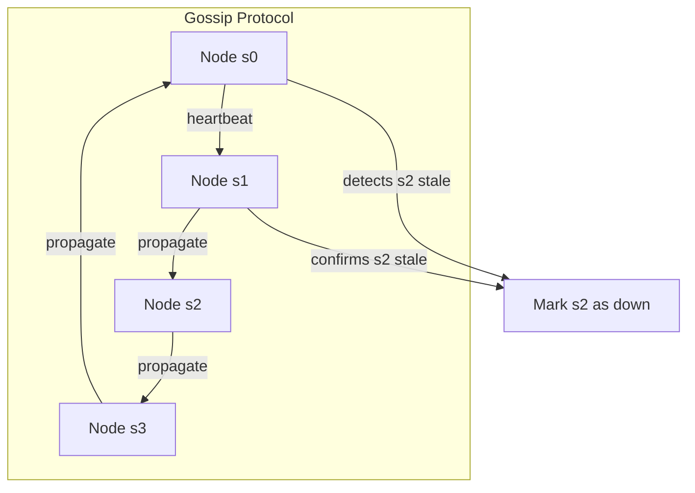

## Summary

The gossip protocol is a decentralized failure detection mechanism where each node maintains a membership list with heartbeat counters. Nodes periodically send heartbeats to random peers, who propagate them further. If a node's heartbeat counter has not increased beyond a threshold, it is marked as down. This avoids relying on a single monitor and tolerates individual node failures gracefully.

## How It Works

1. Each node maintains a **membership list**: `{member_id: heartbeat_counter, ...}`
2. Each node periodically increments its own heartbeat counter
3. Each node periodically sends its membership list to a random subset of peers
4. Receiving nodes update their local list with the latest heartbeat counters
5. If a member's heartbeat counter has not increased for a predefined period, it is marked offline
6. Multiple nodes must independently confirm the stale heartbeat before declaring failure

## When to Use

- Decentralized distributed systems with no single coordinator
- Large clusters where all-to-all heartbeats are too expensive
- Systems that need to tolerate monitor failures (no single point of failure for detection)
- Peer-to-peer networks and eventually consistent databases

## Trade-offs

| Aspect | Benefit | Cost |
|---|---|---|
| Decentralized | No single point of failure for detection | Slower convergence than centralized |
| Random peer selection | Scales to large clusters | Non-deterministic detection time |
| Heartbeat threshold | Avoids false positives from transient issues | Slower failure detection |
| Propagation rounds | Eventually reaches all nodes | Adds detection latency |

## Real-World Examples

- **Apache Cassandra** uses gossip protocol for cluster membership and failure detection
- **Amazon DynamoDB** uses gossip-based protocols for membership management
- **Consul** (HashiCorp) uses SWIM gossip protocol variant for membership
- **Serf** (HashiCorp) is a dedicated gossip-based membership tool

## Common Pitfalls

- Setting the failure threshold too low, causing false positives during network blips
- Setting it too high, delaying detection of genuinely failed nodes
- Not requiring multi-source confirmation before marking a node down
- Assuming gossip propagation is instant (it takes O(log N) rounds for full propagation)

## See Also

- [[merkle-trees]] -- used alongside gossip for data synchronization after failure detection
- [[data-replication]] -- replication strategies that depend on accurate failure detection
- [[quorum-consensus]] -- sloppy quorum uses failure detection to route around failed nodes
