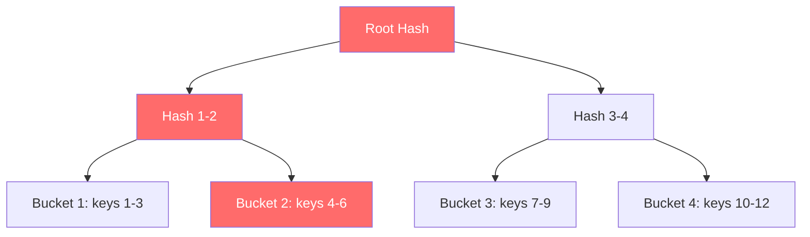

## Summary

A Merkle tree (hash tree) is a tree where every non-leaf node contains the hash of its children's values. In distributed key-value stores, Merkle trees enable efficient detection of data inconsistencies between replicas. By comparing root hashes first, then drilling into only the subtrees that differ, the amount of data transferred during synchronization is proportional to the differences rather than the total dataset.

## How It Works

1. Divide the key space into buckets (e.g., 1M buckets for 1B keys = 1000 keys/bucket)
2. Hash each key within its bucket
3. Create a single hash for each bucket (leaf nodes)
4. Build the tree upward by hashing pairs of child hashes
5. **Compare**: start at root hashes of two replicas
6. If root hashes match, replicas are identical (done)
7. If they differ, recurse into mismatched subtrees
8. Only synchronize the specific buckets that differ

## When to Use

- Anti-entropy repair of permanently diverged replicas
- Background synchronization processes in distributed databases
- Any system that needs to efficiently diff large datasets across nodes
- File synchronization systems (e.g., detecting changed blocks)

## Trade-offs

| Aspect | Benefit | Cost |
|---|---|---|
| Top-down comparison | Skip entire subtrees that match | Tree must be rebuilt when data changes |
| Proportional transfer | Only sync divergent buckets | O(n) space for tree structure |
| Bucket granularity | Controls precision vs tree size | More buckets = deeper tree |
| Background process | Does not block foreground operations | Uses CPU/network bandwidth |

## Real-World Examples

- **Apache Cassandra** uses Merkle trees for anti-entropy repair (`nodetool repair`)
- **Amazon DynamoDB** employs Merkle trees for background replica synchronization
- **Git** uses a Merkle tree (of commits and blobs) to detect changes efficiently
- **Bitcoin/Ethereum** use Merkle trees to verify transaction integrity
- **IPFS** uses Merkle DAGs for content-addressed storage

## Common Pitfalls

- Rebuilding the entire Merkle tree on every write (use incremental updates or periodic rebuilds)
- Choosing too few buckets, making synchronization coarse-grained
- Running anti-entropy too frequently, consuming network bandwidth
- Not running it frequently enough, letting replicas drift far apart

## See Also

- [[data-replication]] -- the context in which Merkle trees detect inconsistencies
- [[gossip-protocol]] -- detects failures; Merkle trees repair the resulting inconsistencies
- [[quorum-consensus]] -- hinted handoff handles temporary failures; Merkle trees handle permanent ones
