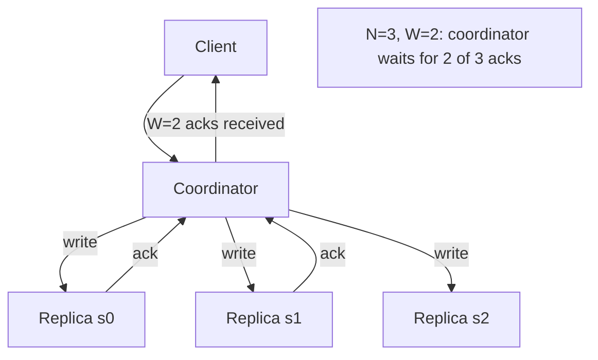

## Summary

Quorum consensus is a technique for tuning consistency in replicated systems using three parameters: N (number of replicas), W (write quorum -- how many replicas must acknowledge a write), and R (read quorum -- how many replicas must respond to a read). When `W + R > N`, at least one replica in the read set has the latest write, guaranteeing strong consistency.

## How It Works

1. Data is replicated to N servers
2. For writes, the coordinator sends the write to all N replicas but only waits for W acknowledgments
3. For reads, the coordinator queries all N replicas but only waits for R responses
4. If `W + R > N`, the read and write sets must overlap, ensuring at least one fresh copy is read
5. The coordinator acts as a proxy between client and replica nodes

**Common configurations:**
- `N=3, W=2, R=2` -- balanced strong consistency
- `N=3, W=1, R=3` -- fast writes, slow reads
- `N=3, W=3, R=1` -- slow writes, fast reads
- `N=3, W=1, R=1` -- fastest, but eventual consistency only

## When to Use

- Systems needing tunable consistency per use case
- When different operations have different consistency requirements
- Distributed databases that must balance latency and consistency
- Systems where the read/write ratio drives the optimal W/R configuration

## Trade-offs

| Configuration | Consistency | Write Latency | Read Latency |
|---|---|---|---|
| W=1, R=1 | Eventual | Lowest | Lowest |
| W=2, R=2 (N=3) | Strong | Moderate | Moderate |
| W=1, R=N | Eventual writes, strong reads | Lowest | Highest |
| W=N, R=1 | Strong writes, fast reads | Highest | Lowest |

## Real-World Examples

- **DynamoDB** supports configurable consistent reads (R=N) vs eventually consistent reads (R=1)
- **Cassandra** allows per-query consistency levels: ONE, QUORUM, ALL
- **Riak** lets clients specify W and R per request
- **Apache ZooKeeper** uses majority quorum for writes

## Common Pitfalls

- Assuming `W + R > N` means zero-latency consistency (it still depends on the slowest replica)
- Setting `W = N` or `R = N`, which means one slow/failed replica blocks all operations
- Not understanding that the coordinator waits for the **slowest** of the W or R responses
- Forgetting that `W + R <= N` does not prevent consistency -- it just does not guarantee it

## See Also

- [[cap-theorem]] -- the theoretical foundation for consistency/availability trade-offs
- [[data-replication]] -- the N replicas that quorum operates over
- [[vector-clocks]] -- resolving conflicts when W + R <= N
