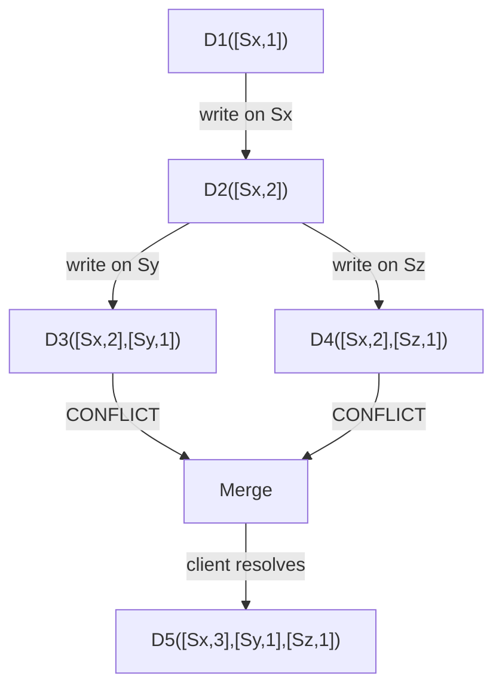

## Summary

A vector clock is a `[server, version]` pair list associated with each data item, used to track causal ordering of writes and detect conflicts in eventually consistent systems. If one version's counters are all >= another's, it is a descendant (no conflict). If counters are mixed (some higher, some lower), the versions are siblings (conflict) and must be reconciled by the client.

## How It Works

1. Each data item carries a vector clock: `D([S1, v1], [S2, v2], ...)`
2. When server Si handles a write, it increments its counter vi (or creates `[Si, 1]`)
3. **Ancestor check**: version X is an ancestor of Y if all counters in X are <= corresponding counters in Y
4. **Conflict check**: X and Y conflict if some counter in X is greater and some is less than in Y
5. On conflict, both versions are returned to the client for reconciliation
6. The reconciled version merges the vector clocks and increments the writing server's counter

## When to Use

- Eventually consistent distributed databases (DynamoDB, Riak)
- Systems where concurrent writes to the same key are possible
- When client-side conflict resolution is acceptable
- Any AP system that needs to detect and resolve conflicting writes

## Trade-offs

| Aspect | Benefit | Cost |
|---|---|---|
| Conflict detection | Accurately identifies concurrent writes | Client must implement resolution logic |
| Causal ordering | Determines ancestor/descendant relationships | Vector grows with number of servers |
| No coordination | Writers do not need to synchronize | Conflicts surface at read time |
| Truncation (threshold) | Bounds vector size | May lose ancestry info, causing false conflicts |

## Real-World Examples

- **Amazon DynamoDB** uses vector clocks for conflict detection (described in the Dynamo paper)
- **Riak** implements vector clocks (and later dotted version vectors) for concurrent write detection
- **Voldemort** (LinkedIn) uses vector clocks for versioning
- **Cassandra** uses timestamps instead of vector clocks (last-write-wins), trading accuracy for simplicity

## Common Pitfalls

- Letting vector clocks grow unbounded -- set a threshold and prune oldest entries
- Assuming vector clocks resolve conflicts automatically (the client must do the resolution)
- Confusing vector clocks with Lamport timestamps (Lamport gives total order but cannot detect conflicts)
- Not handling the case where pruning causes false conflict detection

## See Also

- [[quorum-consensus]] -- the consistency mechanism that interacts with vector clocks
- [[data-replication]] -- replication creates the concurrent-write scenarios vector clocks detect
- [[cap-theorem]] -- AP systems that rely on vector clocks for conflict resolution
