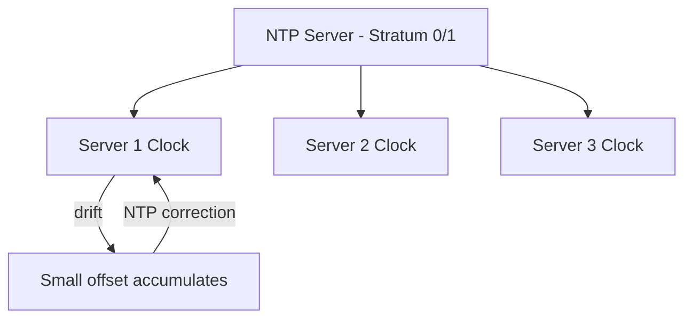

## Summary

Clock synchronization is the challenge of keeping system clocks aligned across distributed servers. Timestamp-based ID generation schemes like Twitter Snowflake depend on reasonably synchronized clocks. **Network Time Protocol (NTP)** is the standard solution, but clock drift, network delays, and leap seconds can cause clocks to diverge, potentially leading to duplicate or out-of-order IDs.

## How It Works

1. NTP servers (stratum 0/1) provide authoritative time references
2. Each server periodically queries NTP to measure its clock offset
3. The local clock is gradually adjusted (slewed) to minimize disruption
4. Typical NTP accuracy: 1-50ms over the internet, < 1ms on LAN
5. For tighter synchronization, GPS-based clocks or Google TrueTime can achieve microsecond accuracy
6. Multi-core servers may have per-core clock drift requiring OS-level synchronization

## When to Use

- Any system using timestamps for ordering events (Snowflake IDs, log correlation)
- Distributed databases that use timestamps for conflict resolution (Spanner, CockroachDB)
- Audit and compliance systems requiring accurate event timestamps
- Real-time systems where time accuracy affects correctness

## Trade-offs

| Aspect | Benefit | Cost |
|---|---|---|
| NTP | Simple, widely deployed | 1-50ms accuracy; network dependent |
| GPS clocks | Sub-microsecond accuracy | Hardware cost, maintenance |
| Google TrueTime | Bounded uncertainty interval | Proprietary, requires GPS + atomic clocks |
| Logical clocks (alternative) | No physical clock dependency | Cannot correlate with wall-clock time |

## Real-World Examples

- **Google Spanner** uses TrueTime (GPS + atomic clocks) to provide globally consistent timestamps
- **CockroachDB** uses NTP with uncertainty intervals for serializable transactions
- **AWS** provides the Amazon Time Sync Service for EC2 instances (NTP-based, < 1ms)
- **Twitter Snowflake** relies on NTP for timestamp-based ID generation

## Common Pitfalls

- Assuming all servers have the same clock (they never do without active synchronization)
- Using `step` NTP correction instead of `slew`, causing time to jump backward
- Not monitoring NTP drift and alerting when offset exceeds a threshold
- Ignoring leap seconds, which can cause a 1-second ambiguity window

## See Also

- [[twitter-snowflake]] -- ID scheme that critically depends on synchronized clocks
- [[vector-clocks]] -- an alternative that uses logical time instead of physical clocks
