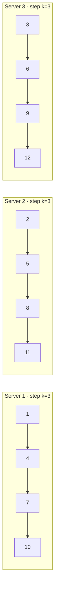

## Summary

Multi-master replication generates unique IDs by using each database server's `auto_increment` feature with a step size of k (the number of servers). Server 1 generates IDs 1, 3, 5, ...; server 2 generates 2, 4, 6, ...; and so on. This avoids collisions without coordination, but IDs are not globally time-ordered and the scheme is rigid when servers are added or removed.

## How It Works

1. Set up k database servers, each with `auto_increment` starting at a different offset (1 through k)
2. Each server increments by k instead of 1
3. IDs are guaranteed unique across servers since each produces a distinct modular residue
4. No cross-server coordination is needed for ID generation
5. Adding or removing a server requires changing k across all servers and potentially reseeding

## When to Use

- Simple systems with a fixed, small number of database servers
- When IDs do not need to be time-sortable across servers
- Legacy systems already using auto-increment that need basic horizontal scaling
- When the operational complexity of changing k is acceptable

## Trade-offs

| Aspect | Benefit | Cost |
|---|---|---|
| Simplicity | Uses built-in DB feature | Cannot reorder by time across servers |
| No coordination | Each server generates independently | Hard to add/remove servers (k changes) |
| Numeric IDs | Fits in 64-bit integer | IDs interleave, not monotonically increasing globally |
| Database-native | No external service needed | Tied to database availability |

## Real-World Examples

- Small-scale web applications with two MySQL primaries for redundancy
- Read-write splitting setups where each primary generates its own ID range
- Legacy sharded databases that predate distributed ID generators

## Common Pitfalls

- Changing k (adding/removing servers) without a coordinated migration plan
- Assuming IDs from different servers are temporally ordered (they are not)
- Not accounting for the gap in IDs when a server is down
- Using this approach when time-sortable IDs are a requirement

## See Also

- [[ticket-server]] -- centralized alternative avoiding the k-step problem
- [[uuid]] -- decentralized approach without step coordination
- [[twitter-snowflake]] -- time-sortable distributed IDs
