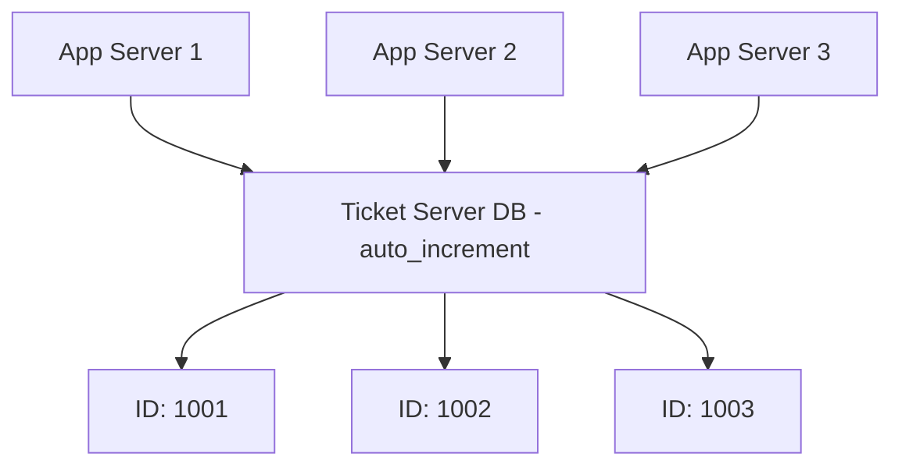

## Summary

A ticket server is a centralized service that generates unique, sequential, numeric IDs using a single database with `auto_increment`. Pioneered by Flickr, it is simple to implement and guarantees ordered numeric IDs. The main drawback is that it creates a **single point of failure**; running multiple ticket servers for redundancy introduces synchronization complexity.

## How It Works

1. A single database server acts as the ticket server
2. It uses `auto_increment` on a dedicated table to issue sequential IDs
3. Application servers request IDs from the ticket server over the network
4. The ticket server returns the next available ID atomically
5. For redundancy, run two ticket servers with interleaved IDs (odd/even), but this adds coordination complexity

## When to Use

- Small to medium-scale applications where simplicity is valued
- When IDs must be strictly sequential and numeric
- Systems where a centralized service is operationally acceptable
- Internal tools or services with moderate throughput requirements

## Trade-offs

| Aspect | Benefit | Cost |
|---|---|---|
| Simplicity | One DB, built-in auto_increment | Single point of failure |
| Sequential IDs | Monotonically increasing, easy to reason about | Centralized bottleneck |
| Numeric | Fits in 64-bit, compact | Requires network round trip |
| Multiple ticket servers | Redundancy | Synchronization complexity, interleaved IDs |

## Real-World Examples

- **Flickr** used ticket servers for generating photo IDs and other primary keys
- Small startups often use a single PostgreSQL sequence as a ticket server before scaling
- Internal microservices that need simple, ordered IDs without distributed complexity

## Common Pitfalls

- Relying on a single ticket server without a failover plan
- Not provisioning for the network latency of ticket server requests
- Running multiple ticket servers without clearly defining the interleaving scheme
- Assuming a ticket server scales linearly (it becomes a bottleneck at high QPS)

## See Also

- [[twitter-snowflake]] -- decentralized, time-sortable alternative with no SPOF
- [[multi-master-replication]] -- distributed approach using DB auto-increment with step k
- [[uuid]] -- fully decentralized but 128-bit
