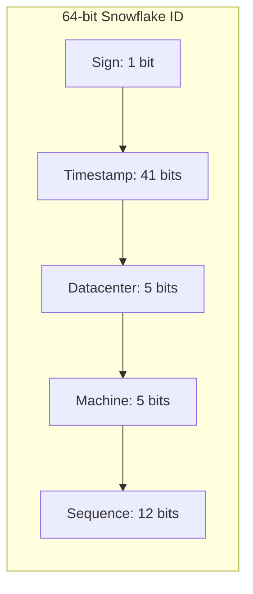

## Summary

Twitter Snowflake is a 64-bit ID generation scheme that divides the ID into sections: 1 sign bit, 41 timestamp bits, 5 datacenter bits, 5 machine bits, and 12 sequence bits. IDs are time-sortable, globally unique, decentralized (each machine generates independently), and support ~4096 IDs per millisecond per machine. The 41-bit timestamp gives ~69 years of lifespan from a custom epoch.

## How It Works

1. **Sign bit** (1): always 0, reserved for future use
2. **Timestamp** (41 bits): milliseconds since custom epoch (e.g., 2010-11-04 for Twitter)
3. **Datacenter ID** (5 bits): supports 32 datacenters
4. **Machine ID** (5 bits): supports 32 machines per datacenter
5. **Sequence number** (12 bits): increments for each ID within the same millisecond, resets to 0 each ms
6. Total capacity: 32 DCs x 32 machines x 4096 IDs/ms = ~4 billion IDs/sec globally

## When to Use

- Systems requiring 64-bit, time-sortable, unique IDs
- High-throughput distributed environments (> 10,000 IDs/sec)
- When IDs need to be naturally ordered by creation time
- Microservice architectures where each service generates its own IDs

## Trade-offs

| Aspect | Benefit | Cost |
|---|---|---|
| Time-sortable | IDs ordered by creation time | Depends on synchronized clocks |
| 64-bit | Compact, fits in long/bigint | 69-year lifespan per epoch |
| Decentralized | No central bottleneck or SPOF | Datacenter/machine IDs must be assigned carefully |
| 4096 IDs/ms | Sufficient for most workloads | Exceeding this rate in a single ms requires waiting |
| Bit allocation tunable | Adjust for specific needs | Changing allocation requires migration |

## Real-World Examples

- **Twitter** created Snowflake for tweet IDs and internal service IDs
- **Discord** uses a Snowflake variant for message and user IDs
- **Instagram** uses a Snowflake-inspired scheme with different bit allocations
- **Baidu** uid-generator is based on Snowflake
- **Sony** Sonyflake is a Snowflake variant optimized for fewer machines over longer time

## Common Pitfalls

- Clock drift or rollback causing duplicate IDs (use NTP and handle clock-backward events)
- Accidentally reusing datacenter/machine ID combinations after redeployment
- Not planning for the 69-year epoch expiration
- Allocating too many sequence bits for low-concurrency systems (wasting timestamp range)

## See Also

- [[clock-synchronization]] -- critical dependency for timestamp accuracy
- [[multi-master-replication]] -- simpler but less capable alternative
- [[uuid]] -- 128-bit alternative without time sorting
- [[ticket-server]] -- centralized alternative
