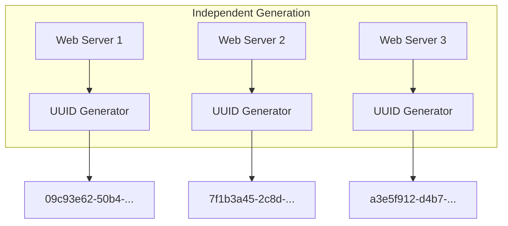

## Summary

A UUID is a 128-bit identifier generated independently on each server with an astronomically low collision probability (generating 1 billion UUIDs per second for ~100 years yields a 50% chance of one duplicate). UUIDs require no coordination between servers, making them easy to scale. However, they are 128 bits (not 64), not time-sortable, and may contain non-numeric characters.

## How It Works

1. Each server has its own UUID generator (built into most programming languages)
2. UUIDs are generated using random numbers, timestamps, MAC addresses, or a combination
3. No server-to-server coordination is needed
4. The 128-bit space is so large that collisions are statistically negligible
5. Format: `xxxxxxxx-xxxx-xxxx-xxxx-xxxxxxxxxxxx` (hex with dashes)

## When to Use

- When uniqueness is the only requirement (no time sorting, no size constraint)
- Quick prototyping or systems where ID format does not matter
- Distributed systems where zero coordination is paramount
- When 128-bit IDs are acceptable (e.g., document IDs, correlation IDs)

## Trade-offs

| Aspect | Benefit | Cost |
|---|---|---|
| No coordination | Each server generates independently | No global ordering |
| 128-bit space | Near-zero collision probability | Does not fit in 64-bit integer |
| Simplicity | Built into every language/DB | Not time-sortable |
| Alphanumeric | Human-readable format | May contain non-numeric characters |

## Real-World Examples

- **MongoDB** ObjectIDs (a 96-bit variant with embedded timestamp)
- **PostgreSQL** `uuid` type for primary keys
- **Microservice tracing** (distributed trace IDs are often UUIDs)
- **AWS** resource identifiers use UUID-like formats

## Common Pitfalls

- Using UUID v4 (random) for database primary keys in B-tree indexes (poor locality, slow inserts)
- Assuming UUIDs are sortable by creation time (only v1/v7 embed timestamps)
- Storing UUIDs as strings instead of native 128-bit types (wastes space and slows comparisons)
- Choosing UUIDs when the requirement specifies 64-bit numeric IDs

## See Also

- [[twitter-snowflake]] -- 64-bit, time-sortable alternative
- [[ticket-server]] -- centralized numeric ID generation
- [[multi-master-replication]] -- another decentralized approach using DB auto-increment
