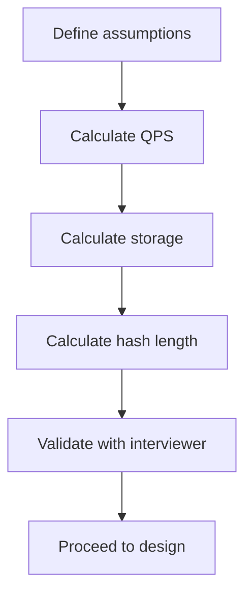

## Summary

Back-of-the-envelope estimation is the practice of making quick, approximate calculations to scope a system's requirements before diving into detailed design. For a URL shortener, this involves computing write/read QPS, total storage over the system's lifespan, and the minimum hash length needed. These numbers ground the design in reality and align interviewer and candidate on assumptions.

## How It Works

**URL Shortener Example** (from the chapter):

1. **Write volume**: 100M URLs/day
2. **Write QPS**: 100M / 86,400 = ~1,160 writes/sec
3. **Read QPS** (10:1 ratio): ~11,600 reads/sec
4. **Total records** (10 years): 100M x 365 x 10 = 365 billion
5. **Storage** (100 bytes avg): 365B x 100B = 36.5 TB
6. **Hash length**: need 62^n >= 365B; n=7 gives 3.5T (sufficient)

## When to Use

- The opening phase of any system design interview
- Before choosing architecture components (to know the scale)
- Capacity planning for new features or services
- Cost estimation for infrastructure budgeting

## Trade-offs

| Aspect | Benefit | Cost |
|---|---|---|
| Quick calculations | Grounds design in realistic numbers | Approximations may miss edge cases |
| Shared assumptions | Aligns team/interviewer on scope | Wrong assumptions propagate errors |
| Order-of-magnitude accuracy | Sufficient for architecture decisions | Not precise enough for final provisioning |
| Simple arithmetic | Accessible, no tools needed | May oversimplify (e.g., ignoring peak vs average) |

## Real-World Examples

- **Google** engineers use back-of-the-envelope math to evaluate new project feasibility
- **Amazon** capacity planning starts with traffic estimates and works backward to infrastructure
- **System design interviews** at top tech companies expect candidates to estimate before designing
- **Jeff Dean's "Numbers Everyone Should Know"** is a canonical reference for latency/throughput estimates

## Common Pitfalls

- Forgetting to distinguish between peak and average QPS (peak can be 2-10x average)
- Using bytes vs bits inconsistently
- Not accounting for metadata overhead (indexes, replication, protocol headers)
- Over-engineering for 10 years of growth when the system may be redesigned in 2 years
- Forgetting to include read amplification from caching misses

## See Also

- [[url-shortening]] -- the system these estimates are scoping
- [[url-redirecting]] -- read QPS drives cache sizing
- [[base62-conversion]] -- hash length estimation feeds directly into this choice
