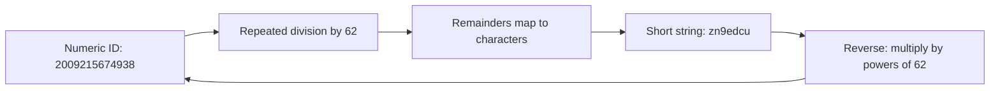

## Summary

Base-62 conversion encodes a numeric ID using 62 characters (`0-9`, `a-z`, `A-Z`) to produce short, URL-safe strings. A 7-character base-62 string can represent up to 62^7 = ~3.5 trillion unique values, which is sufficient for most URL shortening services. The conversion is deterministic and reversible: each ID maps to exactly one string and vice versa, eliminating the need for collision resolution.

## How It Works

1. **Character set**: `0123456789abcdefghijklmnopqrstuvwxyzABCDEFGHIJKLMNOPQRSTUVWXYZ` (62 characters)
2. **Encode**: repeatedly divide the numeric ID by 62, mapping each remainder to a character
3. **Reverse** the collected characters to get the final short string
4. **Decode**: multiply each character's index by the corresponding power of 62 and sum

**Example**: ID `11157` = 2 x 62^2 + 55 x 62^1 + 59 x 62^0 = `[2, 55, 59]` = `2TX`

## When to Use

- URL shorteners where a unique numeric ID is already available
- Any system that needs compact, alphanumeric representations of large numbers
- When you want deterministic, collision-free encoding
- Human-readable short codes (case-sensitive)

## Trade-offs

| Aspect | Benefit | Cost |
|---|---|---|
| Deterministic | Same ID always produces same string | Requires a unique ID source (Snowflake, DB sequence) |
| Collision-free | No collision resolution logic needed | Depends on ID generator uniqueness |
| Compact | 7 chars for 3.5T values | Case-sensitive (may confuse users) |
| Reversible | Can decode back to numeric ID | IDs are predictable/enumerable |

## Real-World Examples

- **YouTube** uses base-62-like encoding for video IDs (11 characters, case-sensitive)
- **Instagram** short codes use a base-62 variant for media URLs
- **Pastebin** uses base-62 encoding for paste IDs
- **Stack Overflow** uses base-62 for short question/answer links

## Common Pitfalls

- Confusing similar characters (0/O, 1/l/I) -- consider base-58 if user input is expected
- Not accounting for leading zeros in the encoded string (rare but possible)
- Exposing sequential IDs, allowing enumeration of all shortened URLs
- Assuming base-62 strings are case-insensitive (they are NOT: `a` != `A`)

## See Also

- [[url-shortening]] -- the flow that uses base-62 conversion
- [[hash-collision-resolution]] -- the alternative approach that does not use base-62
- [[twitter-snowflake]] -- a common source of unique IDs for base-62 encoding
