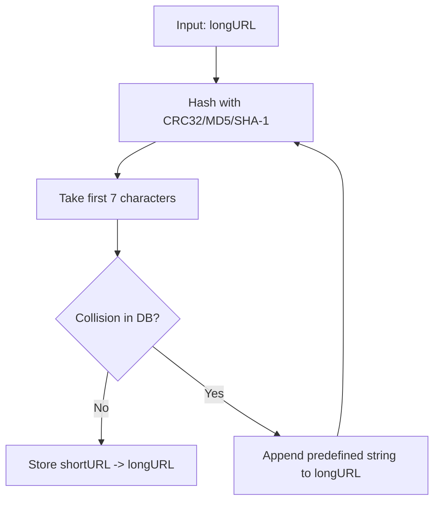

## Summary

An alternative to base-62 conversion for URL shortening is to hash the long URL directly (using CRC32, MD5, or SHA-1) and truncate the output to 7 characters. Since truncation causes collisions, a resolution strategy is needed: recursively append a predefined string and re-hash until no collision is found. A **bloom filter** can speed up the collision check by reducing database lookups.

## How It Works

1. Apply a hash function (CRC32, MD5, SHA-1) to the long URL
2. Take the first 7 characters of the hash output
3. Check if this 7-character string already exists in the database
4. If no collision, store the mapping
5. If collision, append a predefined string to the long URL and re-hash
6. Repeat until a unique 7-character code is found
7. Optionally use a **bloom filter** before the DB check to reduce lookups

## When to Use

- When you do not have a distributed unique ID generator available
- Systems where the hash of the URL itself is semantically meaningful
- Prototypes or small-scale systems where collision rates are low
- When you want the same long URL to always produce the same short URL (content-addressed)

## Trade-offs

| Aspect | Benefit | Cost |
|---|---|---|
| No ID generator | Self-contained, hash the input directly | Collisions require resolution |
| Content-addressed | Same URL always hashes the same | Hash truncation increases collision rate |
| Bloom filter | Reduces DB lookups for collision checks | False positives cause unnecessary re-hashes |
| Recursive resolution | Guarantees uniqueness eventually | Multiple DB queries in worst case |

## Real-World Examples

- Early URL shorteners before distributed ID generators were common
- Content-addressed storage systems (IPFS, Git) use similar hash-then-check approaches
- Deduplication systems that hash content to detect duplicates

## Common Pitfalls

- Not using a bloom filter, causing expensive DB lookups on every shortening request
- Choosing MD5 or SHA-1 (overkill for non-cryptographic use; CRC32 is faster)
- Infinite loops if the predefined append string causes cyclic hash collisions (extremely rare but possible)
- Not indexing the shortURL column, making collision checks slow

## See Also

- [[base62-conversion]] -- the preferred alternative that avoids collisions entirely
- [[url-shortening]] -- the overall shortening flow
- [[back-of-envelope-estimation]] -- calculating expected collision rates
