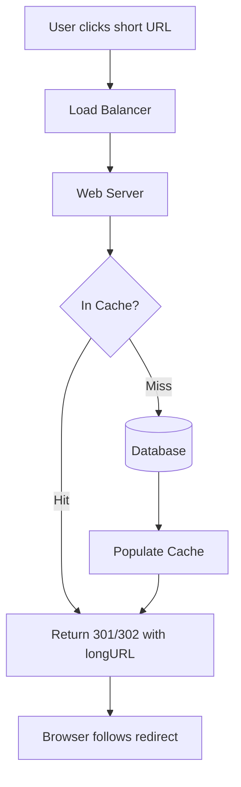

## Summary

URL redirecting is the read path of a URL shortener: when a user visits a short URL, the server looks up the original long URL and returns an HTTP redirect. The choice between **301 (permanent)** and **302 (temporary)** redirect has significant implications: 301 reduces server load via browser caching, while 302 ensures every click passes through the server, enabling analytics.

## How It Works

1. User clicks `https://tinyurl.com/zn9edcu`
2. Load balancer routes request to a web server
3. Web server checks the **cache** for the shortURL-to-longURL mapping
4. If cache miss, query the database and populate the cache
5. Return an HTTP redirect response with the long URL in the `Location` header
6. **301 Permanent**: browser caches the redirect; future requests skip the server
7. **302 Temporary**: browser does NOT cache; every request hits the server

## When to Use

**301 (Permanent)**:
- URL mappings that never change
- When minimizing server load is the priority
- Static content links

**302 (Temporary)**:
- When click analytics (count, source, timing) are important
- A/B testing or rotating destinations
- When the destination URL might change in the future

## Trade-offs

| Aspect | 301 Permanent | 302 Temporary |
|---|---|---|
| Browser caching | Yes -- subsequent clicks bypass server | No -- every click hits server |
| Server load | Lower after first visit | Every click is served |
| Analytics | Cannot track repeat clicks | Full click tracking |
| Destination changes | Cached redirect may be stale | Always fetches current destination |
| SEO | Passes link juice to destination | Link juice stays with short URL |

## Real-World Examples

- **Bitly** uses 301 redirects by default for performance, with analytics tracked server-side before redirect
- **Google** (goo.gl) used 301 redirects
- **Marketing platforms** typically use 302 to track campaign click-through rates
- **Social media** link shorteners use 302 to count engagement

## Common Pitfalls

- Using 301 when analytics are needed (browsers cache and skip your server)
- Using 302 when analytics are not needed (unnecessary server load)
- Not implementing a cache layer for the redirect lookup (database bottleneck)
- Forgetting to handle invalid short URLs gracefully (return 404, not 500)

## See Also

- [[url-shortening]] -- the write path that creates the mappings
- [[base62-conversion]] -- how the short URL codes are generated
- [[back-of-envelope-estimation]] -- calculating read QPS for redirect traffic
