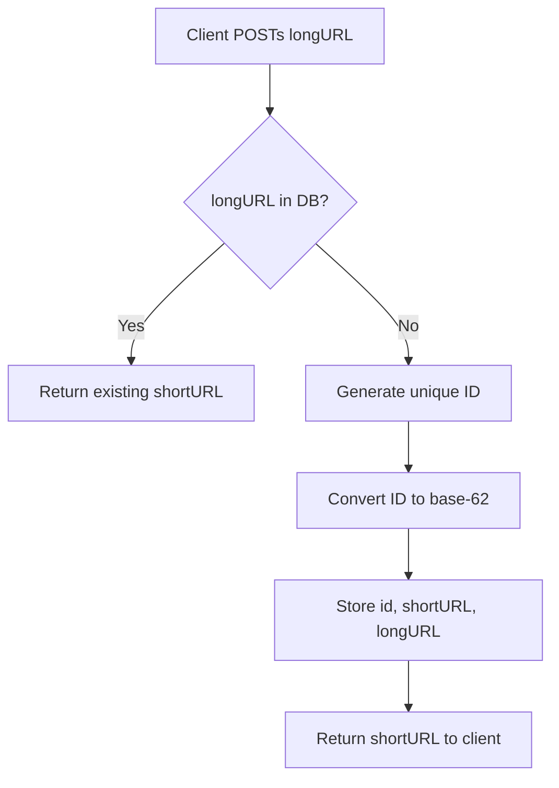

## Summary

The URL shortening flow converts a long URL into a short, shareable link. The preferred approach uses **base-62 conversion** of a unique ID: generate a globally unique numeric ID, convert it to a 7-character base-62 string, and store the mapping in a database. This avoids collision resolution entirely since IDs are unique by construction.

## How It Works

1. Client sends `POST /api/v1/data/shorten` with `{longUrl: "..."}`
2. Check if the long URL already exists in the database
3. If it exists, return the existing short URL (deduplication)
4. If not, generate a new unique ID (via distributed ID generator like Snowflake)
5. Convert the numeric ID to a base-62 string (7 characters)
6. Store `(id, shortURL, longURL)` in the database
7. Return the short URL (e.g., `https://tinyurl.com/zn9edcu`)

## When to Use

- Building a URL shortening service (tinyurl, bit.ly style)
- Creating shareable, trackable links for marketing campaigns
- Reducing URL length for SMS, print media, or character-limited platforms
- Internal link management systems

## Trade-offs

| Aspect | Benefit | Cost |
|---|---|---|
| Base-62 + unique ID | No collision resolution needed | Requires distributed ID generator |
| Hash + collision resolution | No ID generator needed | Expensive DB lookups for collision checks |
| Deduplication check | Same long URL gets same short URL | Extra DB lookup on every write |
| 7-character codes | 3.5 trillion possible URLs | Slightly longer than minimal |

## Real-World Examples

- **Bitly** shortens URLs for marketing analytics and link management
- **TinyURL** provides free URL shortening with optional custom aliases
- **Twitter** (now X) uses t.co for automatic link shortening in tweets
- **Google** used goo.gl (now deprecated) for URL shortening

## Common Pitfalls

- Not deduplicating: the same long URL should return the same short URL
- Exposing sequential IDs without considering privacy (predictable enumeration)
- Not setting up the distributed ID generator before launching
- Forgetting to validate input URLs (malformed, malicious, or overly long)

## See Also

- [[base62-conversion]] -- the encoding scheme for short URL generation
- [[hash-collision-resolution]] -- alternative approach using hash truncation
- [[url-redirecting]] -- the read path that maps short URLs back to long URLs
- [[back-of-envelope-estimation]] -- capacity planning for the shortening service
