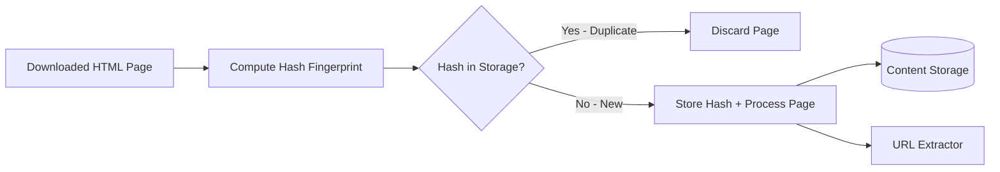

## Summary

Content deduplication detects and eliminates duplicate web pages before they are stored or further processed. Research shows that approximately 29% of web pages are duplicates (same content at different URLs). Rather than comparing pages character by character (which is O(n) per comparison and impractical at scale), crawlers compute hash fingerprints of page content and compare these fixed-size values in O(1) time. Common techniques include SHA-based hashing, Rabin fingerprinting, and SimHash for near-duplicate detection.

## How It Works

1. After downloading a web page, the **content parser** validates the HTML.
2. A **hash function** (e.g., SHA-256, Rabin fingerprint) computes a fixed-size fingerprint of the page content.
3. The fingerprint is checked against a **hash store** (in-memory hash set or Bloom filter).
4. If the fingerprint already exists, the page is a **duplicate** and is discarded.
5. If the fingerprint is new, the page is stored and its links are extracted for further crawling.

## When to Use

- In any large-scale web crawling system where storage and processing costs matter.
- When the same content is mirrored across multiple URLs (e.g., HTTP vs HTTPS, www vs non-www, URL parameters).
- In web archiving to avoid storing redundant copies.
- In search engine indexing to prevent duplicate pages from diluting search quality.

## Trade-offs

| Advantage | Disadvantage |
|---|---|
| Eliminates ~29% of redundant storage and processing | Hash collisions can cause false positives (rare with strong hashes) |
| O(1) comparison instead of O(n) character-by-character | Cannot detect near-duplicates unless using SimHash or similar |
| Bloom filters provide space-efficient membership testing | Bloom filters have false positive rate (no false negatives) |
| Reduces downstream processing load significantly | Requires maintaining a large fingerprint database |

## Real-World Examples

- **Google** uses SimHash to detect near-duplicate web pages in its search index.
- **Internet Archive** deduplicates content during web archiving to save petabytes of storage.
- **Common Crawl** applies content-based deduplication to its monthly web corpus.
- **Rabin fingerprinting** was originally developed at Harvard and is widely used for content chunking and dedup.

## Common Pitfalls

1. **Using exact match only.** Pages with minor differences (ads, timestamps, session IDs) will not match with exact hashing -- consider SimHash for near-duplicate detection.
2. **Not normalizing content.** Strip boilerplate (headers, footers, navigation) before hashing to improve dedup accuracy.
3. **Unbounded hash storage.** The fingerprint database grows with every unique page; plan for disk-backed storage with in-memory caching.
4. **Hash function choice.** MD5 is fast but has known collision vulnerabilities; SHA-256 is safer for large-scale dedup.

## See Also

- [[url-deduplication]] -- Preventing the same URL from being crawled multiple times
- [[url-frontier]] -- Where dedup decisions affect what enters the crawl queue
- [[crawler-extensibility]] -- Adding dedup modules for new content types (images, PDFs)
