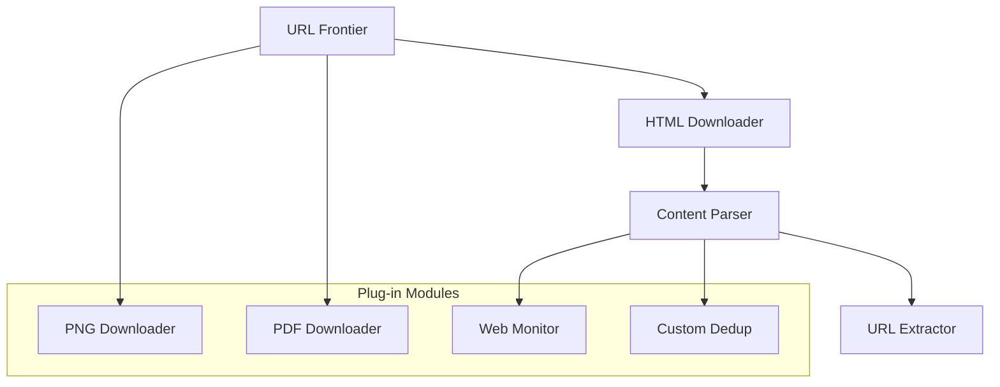

## Summary

A well-designed web crawler uses a modular, plug-in architecture so that new content types, processing steps, or monitoring capabilities can be added without redesigning the core system. For example, adding support for PNG image crawling or a web monitoring module for copyright detection should require only plugging in a new module, not modifying the existing pipeline. This extensibility is achieved through well-defined interfaces between components.

## How It Works

1. The core crawler pipeline defines **standard interfaces** for each stage: URL selection, content download, parsing, extraction, and storage.
2. New **downloader modules** can be registered for specific content types (PNG, PDF, video) that the URL filter routes to based on URL patterns or MIME types.
3. New **processing modules** (web monitors, spam filters, analytics) plug into the post-download pipeline.
4. Each module operates independently and communicates via the standard data format (URL + metadata + content).
5. Configuration determines which modules are active, allowing different crawl profiles for different use cases.

## When to Use

- When building a crawler that may need to support new content types in the future.
- When different teams or use cases require different processing pipelines (search indexing vs. web archiving vs. compliance monitoring).
- When the crawler needs to evolve without service interruptions.

## Trade-offs

| Advantage | Disadvantage |
|---|---|
| New content types require minimal code changes | Module interface design requires upfront investment |
| Teams can develop and deploy modules independently | Too many modules can complicate debugging and monitoring |
| Different crawl profiles for different use cases | Plug-in overhead may slightly increase per-page processing time |
| Easier to test individual components in isolation | Module compatibility and versioning needs management |

## Real-World Examples

- **Apache Nutch** has a plugin architecture for parsers, indexers, and scoring filters.
- **Scrapy** uses middleware pipelines where custom processing steps are plugged in as Python classes.
- **Heritrix** (Internet Archive) uses Spring-configured processing chains with swappable modules.
- **StormCrawler** provides a modular architecture on top of Apache Storm for distributed crawling.

## Common Pitfalls

1. **Tight coupling.** If the core pipeline directly references specific content types, adding new types requires core changes -- define abstract interfaces instead.
2. **No module isolation.** A buggy module should not crash the entire crawler; use error boundaries and timeouts per module.
3. **Monolithic configuration.** Make module activation configurable per crawl job, not hardcoded.
4. **Ignoring resource limits.** New modules (especially media downloaders) may have very different resource requirements; plan for independent scaling.

## See Also

- [[url-frontier]] -- The core pipeline that extensible modules plug into
- [[content-deduplication]] -- An example of a processing module in the pipeline
- [[politeness-constraint]] -- Politeness rules may differ per content type module
