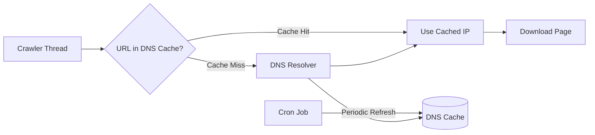

## Summary

DNS resolution is a significant bottleneck for web crawlers because each lookup can take 10-200ms, and the synchronous nature of many DNS interfaces means one slow lookup blocks the entire crawler thread. Maintaining a local DNS cache that maps domain names to IP addresses -- refreshed periodically by background cron jobs -- eliminates repeated DNS lookups and dramatically improves crawl throughput.

## How It Works

1. Before downloading a page, the crawler checks a **local DNS cache** for the domain's IP address.
2. On a **cache hit**, the IP is returned immediately with no network round-trip.
3. On a **cache miss**, the system queries the DNS resolver, stores the result in the cache, and proceeds.
4. A **background cron job** periodically refreshes cache entries to keep them current (respecting TTL values).
5. The cache is typically an in-memory hash map shared across crawler threads on each crawl server.

## When to Use

- In any high-throughput web crawler where DNS lookups are a measurable bottleneck.
- When crawling millions of pages across thousands of domains, many of which are revisited.
- In distributed crawlers where each server maintains its own local DNS cache.
- When DNS resolver infrastructure is slow or has limited throughput.

## Trade-offs

| Advantage | Disadvantage |
|---|---|
| Eliminates 10-200ms per repeated DNS lookup | Stale cache entries may point to outdated IP addresses |
| Prevents DNS resolver from becoming a throughput bottleneck | Requires memory to store domain-to-IP mappings |
| Reduces load on upstream DNS infrastructure | Cron refresh interval must balance freshness vs. overhead |
| Thread-safe shared cache benefits all crawler threads | IP changes during cache TTL window may cause transient failures |

## Real-World Examples

- **Googlebot** maintains extensive DNS caching infrastructure across its distributed crawl fleet.
- **Heritrix** (Internet Archive) caches DNS results with configurable TTL to speed up archival crawling.
- **Operating systems** (macOS, Linux) have built-in DNS caches (`nscd`, `systemd-resolved`) but their TTLs are often too aggressive for crawler use cases.
- **CDN providers** like Cloudflare frequently change DNS mappings, making TTL-aware cache refresh important.

## Common Pitfalls

1. **Infinite TTL.** Never cache DNS results forever; IP addresses change as sites migrate infrastructure.
2. **Not handling DNS failures.** If a domain's DNS lookup fails, retry with backoff rather than skipping permanently.
3. **Per-thread DNS calls.** Without a shared cache, each thread makes independent lookups for the same domains, wasting resources.
4. **Ignoring CNAME chains.** Some domains involve multiple DNS hops; cache the final resolved IP, not intermediate results.

## See Also

- [[url-frontier]] -- DNS caching accelerates the URL download pipeline
- [[politeness-constraint]] -- Per-host delays work in conjunction with cached DNS lookups
- [[url-deduplication]] -- Different URLs may resolve to the same IP; DNS cache aids identification
