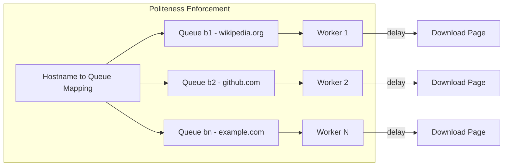

## Summary

Politeness in web crawling means limiting the rate at which a crawler sends requests to any single host, preventing behavior that could be perceived as a denial-of-service attack. The standard approach assigns each hostname to a dedicated FIFO queue served by a single worker thread, which downloads pages one at a time with a configurable delay between requests. This is enforced through the back-queue module of the URL Frontier.

## How It Works

1. A **mapping table** associates each hostname with exactly one back queue.
2. The **queue router** ensures all URLs from the same host land in the same queue.
3. Each back queue is served by exactly **one worker thread** that downloads pages sequentially.
4. A **configurable delay** (e.g., 1-10 seconds) is inserted between consecutive downloads from the same host.
5. Before crawling any site, the worker checks and caches the site's **robots.txt** file to respect disallowed paths.

## When to Use

- Any crawler operating at scale that hits multiple domains.
- When crawling high-traffic sites that actively monitor and block aggressive bots.
- When robots.txt specifies a crawl-delay directive.
- In conjunction with the URL Frontier's priority module to balance speed and courtesy.

## Trade-offs

| Advantage | Disadvantage |
|---|---|
| Avoids being blocked or throttled by target websites | Slows down overall crawl speed for any single domain |
| Respects robots.txt directives and crawl-delay | Requires maintaining hostname-to-queue mapping table |
| Prevents legal issues from aggressive crawling | Worker threads may sit idle if their queue is empty |
| Allows different delay settings per domain | Adds operational complexity for tuning delay parameters |

## Real-World Examples

- **Googlebot** respects robots.txt and adaptively adjusts crawl rate based on server response times.
- **Scrapy** (Python framework) has built-in `DOWNLOAD_DELAY` and `AUTOTHROTTLE` settings for per-domain politeness.
- **Heritrix** (Internet Archive crawler) implements politeness policies with per-host queues and configurable delays.

## Common Pitfalls

1. **Ignoring robots.txt.** Many sites specify crawl rate limits in robots.txt; violating them can lead to IP bans.
2. **Same delay for all hosts.** Different sites have different capacities; a 1-second delay may be too aggressive for small sites and too conservative for large CDN-backed sites.
3. **Not caching robots.txt.** Downloading robots.txt before every page fetch wastes bandwidth; cache it and refresh periodically.
4. **Confusing per-host with per-IP politeness.** Multiple hostnames may resolve to the same IP; true politeness should consider the underlying server.

## See Also

- [[url-frontier]] -- The data structure that implements politeness via back queues
- [[dns-caching]] -- Caching DNS lookups to avoid bottlenecking the crawl pipeline
- [[crawler-extensibility]] -- Making politeness rules configurable per content type
