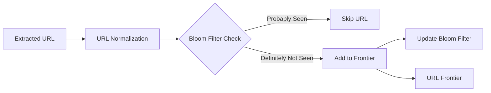

## Summary

The "URL Seen?" component tracks which URLs have already been visited or are currently in the URL Frontier, preventing the crawler from adding the same URL multiple times. This avoids infinite loops (especially from spider traps), reduces server load, and keeps the URL Frontier from growing unboundedly. The most common implementation uses a **Bloom filter** -- a space-efficient probabilistic data structure that can tell you whether an element is "definitely not in the set" or "probably in the set."

## How It Works

1. URLs extracted from crawled pages are **normalized** (lowercase, remove fragments, resolve relative paths, canonicalize query parameters).
2. The normalized URL is checked against a **Bloom filter** (or hash table).
3. If the Bloom filter says "probably seen," the URL is **skipped** (small false positive rate is acceptable).
4. If the Bloom filter says "definitely not seen," the URL is **added to the URL Frontier** and the Bloom filter is updated.
5. Visited URLs are also persisted to **URL storage** on disk for recovery after restarts.

### Bloom Filter Mechanics

A Bloom filter uses `k` hash functions and a bit array of size `m`:
- **Insert**: hash the URL with each of the `k` functions, set bits at those positions.
- **Lookup**: hash the URL, check if all `k` bits are set. If any bit is 0, the URL is definitely new.
- **False positive rate**: approximately `(1 - e^(-kn/m))^k` where `n` is the number of inserted elements.

## When to Use

- In any web crawler to prevent revisiting the same URLs.
- When memory is constrained and billions of URLs must be tracked (Bloom filters use ~10 bits per element for <1% false positive rate).
- In distributed crawling where URL partitioning alone is insufficient to prevent cross-partition duplicates.

## Trade-offs

| Advantage | Disadvantage |
|---|---|
| Extremely space-efficient (10 bits/element for 1% FP rate) | False positives cause some valid URLs to be skipped |
| O(k) constant-time insert and lookup | Cannot delete elements (unless using counting Bloom filter) |
| Prevents infinite crawl loops from spider traps | Requires careful sizing -- undersized filters have high FP rates |
| No false negatives -- never misses a duplicate | False positive rate increases as the filter fills up |

## Real-World Examples

- **Googlebot** uses Bloom-filter-like structures to track billions of visited URLs.
- **Apache Nutch** uses Bloom filters in its URL deduplication pipeline.
- **Akamai** uses Bloom filters to avoid caching duplicate web objects.
- **Cassandra** uses Bloom filters to reduce disk lookups for non-existent rows (same underlying technique).

## Common Pitfalls

1. **Not normalizing URLs.** `http://example.com/page` and `http://example.com/page/` are different strings but the same page -- normalize before checking.
2. **Undersizing the Bloom filter.** If you expect 1 billion URLs, allocate enough bits; otherwise the false positive rate degrades quickly.
3. **Ignoring URL parameters.** Session IDs and tracking parameters create distinct URLs for the same content -- strip them.
4. **No persistence.** If the crawler restarts and the Bloom filter is in-memory only, all dedup state is lost; persist periodically.

## See Also

- [[content-deduplication]] -- Detecting duplicate page content after download
- [[url-frontier]] -- The queue system that benefits from URL dedup at ingestion
- [[dns-caching]] -- Another optimization that works alongside URL dedup
