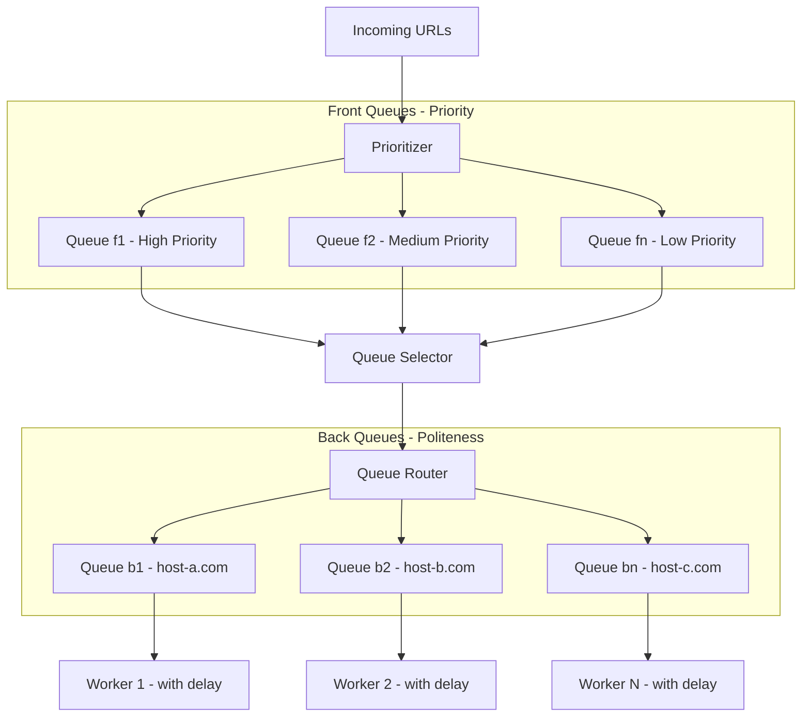

## Summary

The URL Frontier is the central data structure in a web crawler that stores URLs to be downloaded. Unlike a simple FIFO queue, the URL Frontier manages two critical concerns: **prioritization** (crawl important pages first based on PageRank, traffic, and update frequency) and **politeness** (avoid overwhelming any single host with too many concurrent requests). It consists of front queues for priority management and back queues for per-host politeness enforcement.

## How It Works

1. **Prioritizer** computes a priority score for each incoming URL based on PageRank, site traffic, update frequency, or other signals.
2. **Front queues** (f1..fn) hold URLs grouped by priority level. A queue selector picks from higher-priority queues with higher probability.
3. **Queue router** uses a mapping table to ensure each back queue contains URLs from only one hostname.
4. **Back queues** (b1..bn) each serve a single worker thread that downloads pages one at a time from that host, with a configurable delay between requests.
5. **Storage** is hybrid: most URLs reside on disk for durability, with in-memory buffers for fast enqueue/dequeue operations, periodically flushed to disk.

## When to Use

- Any web-scale crawling system that needs to respect host rate limits while prioritizing important content.
- Search engine indexing systems (Google, Bing).
- Large-scale web archiving projects.
- Systems that need to balance throughput against politeness constraints.

## Trade-offs

| Advantage | Disadvantage |
|---|---|
| Prevents denial-of-service behavior toward target hosts | Adds complexity with two-module queue architecture |
| Prioritizes high-value pages for faster indexing | Requires mapping table maintenance for hostname-to-queue routing |
| Hybrid disk/memory storage scales to hundreds of millions of URLs | Disk I/O can become a bottleneck without careful buffer management |
| Decouples priority decisions from politeness enforcement | Priority scoring heuristics need tuning for different crawl goals |

## Real-World Examples

- **Googlebot** uses a sophisticated URL frontier with PageRank-based prioritization and per-host crawl rate limits.
- **Mercator** (early web crawler research) introduced the front queue / back queue architecture described in the chapter.
- **Apache Nutch** implements a URL frontier with configurable politeness delays and priority scoring.
- **Common Crawl** uses frontier scheduling to crawl billions of pages across millions of domains.

## Common Pitfalls

1. **Ignoring politeness.** Without per-host rate limiting, crawlers will be blocked or trigger abuse detection on target sites.
2. **Storing everything in memory.** Hundreds of millions of URLs cannot fit in RAM; use disk-backed storage with memory buffers.
3. **Flat priority.** Treating all URLs equally wastes resources on low-value pages while important pages wait in the queue.
4. **Single queue per host.** If one host has a very slow response time, it should not block crawling of other hosts.

## See Also

- [[politeness-constraint]] -- Detailed mechanisms for per-host rate limiting
- [[content-deduplication]] -- Avoiding re-processing of duplicate content once downloaded
- [[url-deduplication]] -- Bloom filters that prevent the frontier from growing with duplicate URLs
