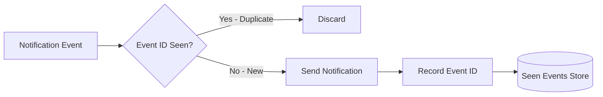

## Summary

In a distributed notification system, duplicate notifications can occur due to retries, network partitions, or message queue redelivery. Since **exactly-once delivery is impossible** in distributed systems, the system implements at-least-once delivery combined with a deduplication mechanism. Each notification event carries a unique **event ID**; before processing, workers check whether this ID has been seen before and discard duplicates.

## How It Works

1. Every notification event is assigned a **unique event ID** at creation time.
2. When a worker picks up an event, it checks the event ID against a **seen-events store** (cache or database).
3. If the event ID **exists**, the event is a duplicate and is **discarded**.
4. If the event ID is **new**, the notification is sent and the event ID is **recorded** in the seen-events store.
5. The seen-events store has a **TTL** (time-to-live) to prevent unbounded growth -- event IDs older than the TTL window are automatically purged.

## When to Use

- In any distributed notification system where retries or queue redelivery can cause duplicate events.
- When notifications have side effects that should not be repeated (e.g., billing alerts, one-time codes).
- When message queue delivery guarantees are "at-least-once" (the most common guarantee).

## Trade-offs

| Advantage | Disadvantage |
|---|---|
| Minimizes duplicate notifications reaching users | Cannot achieve perfect exactly-once delivery |
| Simple to implement with event ID lookups | Requires a fast lookup store (Redis, Memcached) for event IDs |
| TTL-based cleanup prevents unbounded storage growth | Race conditions in distributed workers can still allow rare duplicates |
| Works with any at-least-once message queue | Event ID generation must guarantee uniqueness |

## Real-World Examples

- **AWS SQS + Lambda** uses message deduplication IDs to prevent processing the same message twice within a 5-minute window.
- **Stripe** uses idempotency keys on API requests to prevent duplicate payment notifications.
- **Kafka** consumer groups track offsets to avoid reprocessing, but application-level dedup is still needed for exactly-once semantics.
- **Redis** with TTL-based keys is commonly used as the seen-events store for notification dedup.

## Common Pitfalls

1. **Assuming exactly-once delivery.** It is mathematically impossible in distributed systems; always design for at-least-once with dedup.
2. **No TTL on seen-events.** Without expiration, the store grows indefinitely as event IDs accumulate.
3. **Race conditions.** Two workers processing the same event simultaneously may both pass the dedup check; use atomic check-and-set operations.
4. **Dedup scope too narrow.** If event IDs are only unique per queue but the same event appears in multiple queues (e.g., push + email), dedup must be per-user-per-event.

## See Also

- [[reliability-and-retry]] -- Retry mechanisms that can cause duplicate events
- [[message-queue-decoupling]] -- Queue redelivery as a source of duplicates
- [[rate-limiting-and-opt-in]] -- Rate limits provide an additional layer of protection against notification spam
