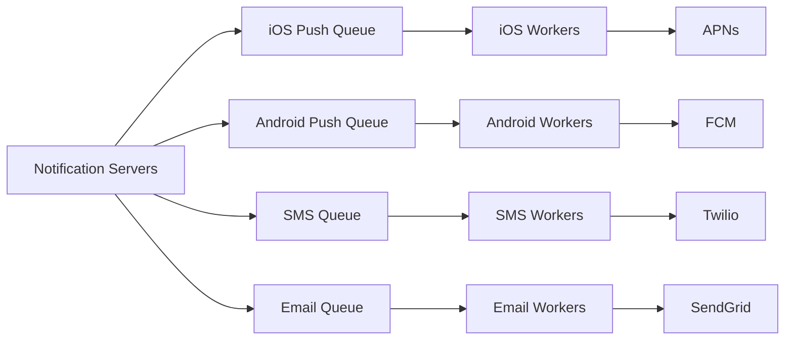

## Summary

In the improved notification system design, per-channel message queues sit between the notification servers and the worker pools. Each notification type (iOS push, Android push, SMS, email) has its own dedicated queue. This decouples the ingestion rate from the delivery rate, enables independent scaling of workers per channel, and provides fault isolation -- an outage in the SMS provider does not affect push notification delivery.

## How It Works

1. **Notification servers** validate incoming requests, check user preferences, render templates, and enqueue notification events to the appropriate channel queue.
2. Each **message queue** buffers events for one notification type, absorbing traffic spikes without dropping messages.
3. **Worker pools** pull events from their assigned queue and deliver them via the corresponding third-party service.
4. Workers can be **scaled independently** -- add more email workers during a marketing campaign without touching SMS workers.
5. If a third-party service goes down, its queue accumulates messages while other channels continue normally.

## When to Use

- Any notification system handling multiple delivery channels with different throughput characteristics.
- When delivery to third-party services has variable latency (email rendering vs. push notification).
- When traffic is bursty (e.g., flash sales, breaking news) and you need to smooth out load.
- When you need fault isolation between delivery channels.

## Trade-offs

| Advantage | Disadvantage |
|---|---|
| Fault isolation -- one channel outage does not affect others | Adds infrastructure complexity (multiple queues to manage) |
| Independent scaling per channel | Slight added latency from queue buffering |
| Absorbs traffic spikes without dropping messages | Requires monitoring queue depth per channel |
| Enables different retry strategies per channel | Worker configuration must be tuned per channel |

## Real-World Examples

- **Amazon SNS + SQS** uses this pattern: SNS fans out to per-channel SQS queues that workers consume.
- **Uber** uses Kafka topics per notification channel for independent consumption.
- **Netflix** uses separate message queues for push, email, and in-app notifications with independent worker pools.
- **RabbitMQ** and **Apache Kafka** are common queue technologies used in production notification systems.

## Common Pitfalls

1. **Single shared queue.** Using one queue for all channels means a slow channel (email rendering) backs up fast channels (push).
2. **Not monitoring queue depth.** A growing queue indicates workers cannot keep up; set alerts and auto-scale.
3. **Unbounded retry in queue.** Failed messages that keep re-entering the queue can cause infinite loops; use dead-letter queues.
4. **Losing messages on queue failure.** Use durable queues with replication; in-memory-only queues risk data loss on crashes.

## See Also

- [[notification-types]] -- The delivery channels that each queue serves
- [[reliability-and-retry]] -- Retry mechanisms that work with the queue infrastructure
- [[rate-limiting-and-opt-in]] -- Rate limits applied before enqueueing
