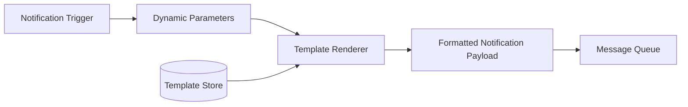

## Summary

A large notification system sends millions of notifications daily, many following similar formats. Notification templates are preformatted layouts with parameterized placeholders for dynamic content (item names, dates, prices, CTAs). They ensure visual and tonal consistency across notifications, reduce the error rate from manually constructing each message, and speed up notification creation by separating content structure from dynamic data.

## How It Works



### Example Template
```
BODY:
  You dreamed of it. We dared it. {ITEM_NAME} is back
  -- only until {DATE}.

CTA:
  Order Now. Or, Save My {ITEM_NAME}
```

1. **Templates are created** by product or marketing teams and stored in a template database/cache.
2. When a notification is triggered, the service provides **dynamic parameters** (item name, date, user name, etc.).
3. The **template renderer** substitutes parameters into the template, producing the final notification payload.
4. The rendered payload is enqueued for delivery via the appropriate channel.
5. Templates can be **versioned** and **A/B tested** to optimize engagement metrics.

## When to Use

- When sending millions of notifications per day with recurring formats (order updates, marketing campaigns, system alerts).
- When consistency of tone, branding, and layout is important.
- When non-engineering teams (marketing, product) need to create and modify notification content.
- When A/B testing notification copy for engagement optimization.

## Trade-offs

| Advantage | Disadvantage |
|---|---|
| Consistent formatting across all notifications | Initial setup effort to create and maintain templates |
| Reduces copy/paste errors in notification content | Template rendering adds a processing step |
| Non-engineers can modify templates without code changes | Complex conditional logic in templates can become hard to maintain |
| Enables A/B testing of notification copy | Template versioning and migration requires tooling |

## Real-World Examples

- **Mailchimp** provides a template builder for email campaigns with drag-and-drop blocks and variable substitution.
- **Firebase** has notification templates with parameter placeholders for push notifications.
- **Twilio** offers SMS templates with dynamic fields for personalized messaging.
- **Slack** uses Block Kit templates for rich interactive notifications with buttons, menus, and formatted text.

## Common Pitfalls

1. **Hardcoding notification text in application code.** This makes updates require code deployments and risks inconsistency.
2. **No localization support.** Templates should support multiple languages with locale-specific variants.
3. **Unbounded parameter length.** Dynamic content (e.g., product names) can exceed channel limits (SMS 160 chars); validate and truncate.
4. **No preview capability.** Without a way to preview rendered templates, errors in formatting or variable substitution go undetected until users see them.

## See Also

- [[notification-types]] -- Templates are channel-specific (push, SMS, email have different format constraints)
- [[rate-limiting-and-opt-in]] -- Templates can carry metadata used for rate-limit categorization
- [[message-queue-decoupling]] -- Rendered template payloads flow through per-channel queues
