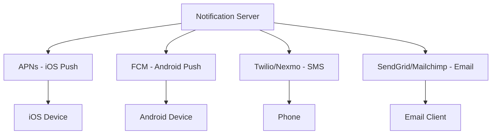

## Summary

A scalable notification system supports three primary delivery channels, each with distinct third-party providers, protocols, and delivery characteristics: **mobile push notifications** (via Apple Push Notification Service for iOS and Firebase Cloud Messaging for Android), **SMS messages** (via services like Twilio or Nexmo), and **email** (via services like SendGrid or Mailchimp). Each channel has unique payload formats, delivery guarantees, and cost structures.

## How It Works

### iOS Push Notification
1. The provider constructs a notification request with a **device token** (unique per device) and a **JSON payload** containing the alert, badge count, and sound.
2. The request is sent to **Apple Push Notification Service (APNs)**.
3. APNs delivers the notification to the target iOS device.

### Android Push Notification
1. Similar flow using **Firebase Cloud Messaging (FCM)** instead of APNs.
2. The payload format and device registration mechanism differ slightly.

### SMS
1. The notification server calls a **third-party SMS API** (Twilio, Nexmo) with the phone number and message text.
2. The SMS provider handles carrier routing and delivery.

### Email
1. The notification server calls a **commercial email service** (SendGrid, Mailchimp) with recipient, subject, and body.
2. The email service handles SMTP delivery, bounce handling, and spam compliance.

### Contact Info Gathering
- Device tokens are collected when users install the app or register devices.
- Phone numbers and email addresses are collected during signup.
- Stored in a `user` table (email, phone) and a `device` table (device tokens; a user can have multiple devices).

## When to Use

- When building any application that needs to alert users about events (e.g., payments, deliveries, news, social activity).
- When users may not be actively using the app and need to be pulled back (push notifications).
- When formal or detailed communication is needed (email).
- When time-sensitive alerts require a channel the user always has (SMS).

## Trade-offs

| Channel | Pros | Cons |
|---|---|---|
| **Push** | Free delivery; rich media; instant | Requires app installation; platform-specific (APNs vs FCM) |
| **SMS** | Universal reach; works without internet | Expensive per message; limited to 160 characters |
| **Email** | Rich content (HTML); attachments; cheap | Lower engagement rate; spam folder risk |

## Real-World Examples

- **Uber** sends push notifications for ride updates, SMS for driver contact, and email for receipts.
- **Amazon** uses email for order confirmations, push for delivery updates, and SMS for two-factor authentication.
- **Slack** sends push notifications for mentions and email digests for missed messages.
- **FCM is unavailable in China**, requiring alternative services like JPush or PushY for Android push in that market.

## Common Pitfalls

1. **Hardcoding a single provider.** Third-party services can have outages or market restrictions; design for provider swappability.
2. **Ignoring platform differences.** APNs and FCM have different payload limits, certificate management, and error codes.
3. **Not collecting device tokens properly.** Token refresh is required after app reinstalls or OS updates; stale tokens cause delivery failures.
4. **Treating all channels the same.** Each channel has unique rate limits, content constraints, and cost structures.

## See Also

- [[message-queue-decoupling]] -- Per-channel queues that isolate delivery failures
- [[reliability-and-retry]] -- Handling delivery failures per channel
- [[notification-templates]] -- Channel-specific template formats
