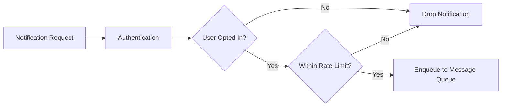

## Summary

Users who receive too many notifications will disable them entirely, losing a valuable engagement channel. Rate limiting caps the number of notifications a user receives within a time window (e.g., max 3 push notifications per hour). Additionally, fine-grained notification settings allow users to opt in or out of specific channels (push, SMS, email) and notification categories. Both checks happen on the notification server **before** enqueueing to the message queue.

## How It Works



### Notification Settings Table
```
user_id   BIGINT
channel   VARCHAR   -- 'push', 'sms', 'email'
opt_in    BOOLEAN   -- true/false
```

### Rate Limiting
1. The notification server checks a **rate limit counter** (e.g., in Redis) for the user + channel combination.
2. If the count exceeds the threshold within the time window, the notification is **suppressed**.
3. The counter is incremented on each send and resets after the time window expires (using TTL).
4. Different thresholds can be set per channel and per notification category.

## When to Use

- In any notification system to prevent user fatigue and maintain engagement.
- When multiple services can independently trigger notifications for the same user.
- When legal requirements mandate opt-out capabilities (CAN-SPAM, GDPR).
- When different notification categories have different urgency levels.

## Trade-offs

| Advantage | Disadvantage |
|---|---|
| Prevents users from disabling all notifications out of frustration | May suppress important notifications if rate limit is too strict |
| Respects user preferences and legal requirements | Requires per-user state storage for settings and counters |
| Reduces cost by avoiding unnecessary sends | Rate limit tuning requires experimentation and analytics |
| Different thresholds per channel enable fine-grained control | Opt-in checks add latency to the notification pipeline |

## Real-World Examples

- **iOS** allows per-app notification settings with options for banners, sounds, badges, and quiet delivery.
- **Gmail** categorizes emails into Primary, Social, and Promotions tabs, effectively rate-limiting user attention.
- **Slack** has granular notification preferences per channel, per workspace, with "Do Not Disturb" schedules.
- **Facebook** reduces notification frequency for less-engaged users to prevent notification fatigue.

## Common Pitfalls

1. **No rate limiting at all.** During events like flash sales, users may receive dozens of notifications in minutes, causing mass opt-outs.
2. **Not checking opt-in before processing.** Sending to opted-out users wastes resources and may violate regulations.
3. **One-size-fits-all limits.** Marketing notifications should have stricter limits than transactional ones (payment confirmations, security alerts).
4. **Not exposing settings to users.** If users cannot control their notification preferences in the app, they will use the OS-level kill switch instead.

## See Also

- [[notification-types]] -- Different channels have different appropriate rate limits
- [[deduplication]] -- Works alongside rate limiting to reduce redundant notifications
- [[notification-templates]] -- Templates can include metadata about notification category for rate-limit routing
