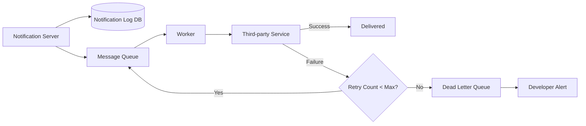

## Summary

A notification system must guarantee that notifications are never lost, even when third-party delivery services fail. This is achieved through two mechanisms: (1) **persisting every notification** to a notification log database before attempting delivery, enabling recovery and retry; and (2) implementing an **exponential-backoff retry mechanism** that requeues failed notifications for a configurable number of attempts before alerting developers.

## How It Works

1. Before enqueuing, the notification server **persists the notification** to a log database with status "pending."
2. The worker pulls the notification from the queue and attempts delivery.
3. On **success**, the log entry is updated to "delivered."
4. On **failure**, the notification is **requeued with exponential backoff** (e.g., retry after 1s, 2s, 4s, 8s...).
5. After exceeding the **maximum retry count**, the notification moves to a **dead-letter queue** and an alert is sent to developers.
6. On system restart, any notifications in "pending" status in the log database are automatically reprocessed.

## When to Use

- In any notification system where lost notifications are unacceptable (payment confirmations, security alerts, delivery updates).
- When third-party services have occasional outages or rate limit failures.
- When the system must survive crashes and restart without data loss.

## Trade-offs

| Advantage | Disadvantage |
|---|---|
| Notifications are never permanently lost | Additional database write for every notification |
| Exponential backoff prevents overwhelming failed services | Increased end-to-end latency for retried notifications |
| Dead-letter queue catches persistent failures for investigation | Retry storms can amplify load during partial outages |
| System can recover from crashes by replaying the log | Log database needs cleanup/archival to prevent unbounded growth |

## Real-World Examples

- **Amazon SES** implements automatic retry with exponential backoff for failed email deliveries.
- **Twilio** retries SMS delivery and provides webhook callbacks with delivery status updates.
- **Firebase Cloud Messaging** queues messages for offline devices and retries when the device comes online.
- **Kafka consumer groups** naturally support retry patterns through offset management and dead-letter topics.

## Common Pitfalls

1. **No persistence before send.** If the system crashes between receiving and sending a notification, it is lost forever without a log database.
2. **Fixed retry intervals.** Without exponential backoff, retries can overwhelm a recovering third-party service.
3. **No retry limit.** Infinite retries for permanently failed notifications (bad device token, invalid email) waste resources.
4. **Ignoring dead-letter queues.** Failed notifications in the DLQ need investigation; they may indicate systematic issues like expired API keys.

## See Also

- [[message-queue-decoupling]] -- Queue infrastructure that supports the retry mechanism
- [[deduplication]] -- Preventing duplicate sends during retry cycles
- [[notification-types]] -- Different channels have different failure modes requiring different retry strategies
