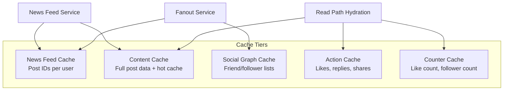

## Summary

The news feed system uses a five-tier cache architecture where each tier is optimized for a specific data type and access pattern. Separating caches by function allows independent scaling, tuning, and eviction policies. The five layers cover: news feed IDs, post content (with hot/cold separation), social graph relationships, user actions (likes, replies), and counters (like count, follower count).

## How It Works

| Layer | Stores | Access Pattern | Example Technology |
|---|---|---|---|
| **News Feed** | List of post IDs per user | Append-on-write, read-on-load | Redis sorted set |
| **Content** | Full post data; popular posts in hot cache | Read-heavy; hot/cold tiering | Memcached + Redis |
| **Social Graph** | Friend and follower relationships | Read on fanout, rarely mutated | Redis hash |
| **Action** | Whether current user liked/shared a post | Read per feed item render | Redis set |
| **Counters** | Aggregate counts (likes, comments, followers) | Increment-on-write, read-heavy | Redis counter |

### Why Five Tiers?

1. **Different eviction policies.** Feed IDs need size-based eviction (cap at 500 entries); content cache needs LRU; counters should never be evicted.
2. **Different scaling profiles.** Content cache needs the most memory; counter cache needs the fastest writes.
3. **Fault isolation.** A failure in the action cache should not affect feed ID retrieval.
4. **Independent tuning.** Each tier can have its own replication factor, TTL, and memory allocation.

## When to Use

- In any system with multiple distinct data types that have different access patterns.
- When a single cache tier would have conflicting requirements (e.g., high-write counters vs. read-heavy content).
- In social media, e-commerce, or content platforms where feeds aggregate multiple data sources.

## Trade-offs

| Advantage | Disadvantage |
|---|---|
| Each tier optimized for its specific access pattern | Increased operational complexity (5 cache clusters to manage) |
| Fault isolation between data types | Feed hydration requires multi-cache lookups |
| Independent scaling per tier | Consistency across tiers requires careful invalidation |
| Hot/cold content separation saves memory | More monitoring and alerting infrastructure needed |

## Real-World Examples

- **Facebook** uses multiple specialized cache layers including TAO (graph), Memcached (content), and custom counters.
- **Twitter** uses Redis for timeline caches and separate Memcached pools for tweet objects and user data.
- **Instagram** separates feed ID caches from media metadata caches and engagement counters.
- **Reddit** uses multiple Redis clusters for different data types: hot posts, vote counts, and user sessions.

## Common Pitfalls

1. **Single monolithic cache.** Mixing feed IDs, post content, and counters in one cache means conflicting eviction policies and inability to scale independently.
2. **Not implementing hot/cold separation for content.** A small percentage of posts generate most of the reads; keep them in a faster tier.
3. **Ignoring cache warming.** After a cache restart, all five tiers are cold simultaneously; stagger restarts and pre-warm critical data.
4. **Inconsistent invalidation.** When a user updates their profile picture, the user cache must be invalidated, but the feed cache (which stores only IDs) does not need updating -- mixing these concerns causes unnecessary invalidation.

## See Also

- [[newsfeed-retrieval]] -- The read path that queries multiple cache tiers for hydration
- [[feed-publishing-flow]] -- The write path that updates feed and content caches
- [[fanout-on-write-vs-read]] -- Determines what data is pre-cached during writes
