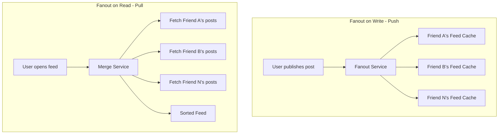

## Summary

Fanout is the process of delivering a post to all of a user's friends' feeds. Two fundamental approaches exist: **fanout on write** (push model) pre-computes the news feed at publish time by immediately writing the post to all friends' feed caches, while **fanout on read** (pull model) computes the feed on demand when a user loads their home page. Each has distinct trade-offs, and the industry standard is a **hybrid approach** that uses push for regular users and pull for high-follower celebrities.

## How It Works

### Fanout on Write (Push)
1. When a user publishes a post, the **fanout service** fetches their friend list from the graph database.
2. The post ID is **appended to each friend's feed cache** immediately.
3. When friends open their feed, the pre-computed list of post IDs is ready -- just hydrate and serve.

### Fanout on Read (Pull)
1. When a user opens their feed, the system **fetches recent posts** from all of the user's friends.
2. Posts are **merged, sorted** (e.g., by timestamp), and returned.
3. No work is done at publish time beyond storing the post.

### Hybrid Approach
- For **regular users** (majority): use fanout on write for fast reads.
- For **celebrities** (many followers): use fanout on read to avoid write amplification that would overwhelm the system.
- Consistent hashing helps distribute the hotkey load for celebrity content.

## When to Use

| Approach | Best For |
|---|---|
| **Fanout on write** | Systems where read latency is critical and most users have moderate friend counts |
| **Fanout on read** | Systems with highly asymmetric follower distributions (Twitter-like) |
| **Hybrid** | Most social media platforms -- balances both concerns |

## Trade-offs

| Aspect | Fanout on Write (Push) | Fanout on Read (Pull) |
|---|---|---|
| Read latency | Fast -- pre-computed | Slow -- computed on demand |
| Write cost | High -- O(friends) writes per post | Low -- single write |
| Hotkey problem | Yes -- celebrities cause write storms | No -- cost shifts to readers |
| Inactive users | Wasted writes for users who never check feed | No wasted compute |
| Implementation | More complex write path | More complex read path |
| Freshness | Immediate | On-demand (always fresh) |

## Real-World Examples

- **Facebook** uses a hybrid push/pull model: push for most users, pull for pages and celebrities with millions of followers.
- **Twitter** originally used pull but moved to push (fanout on write) for the home timeline, with pull for high-follower accounts.
- **Instagram** uses a similar hybrid approach, with pull for accounts that have very large follower counts.
- **LinkedIn** uses a mix of push and pull depending on the connection count and content type.

## Common Pitfalls

1. **Pure push for all users.** A celebrity with 10 million followers publishing a post would require 10 million cache writes simultaneously -- the hotkey problem.
2. **Pure pull for all users.** Every feed load requires fetching and merging posts from hundreds of friends in real time, causing slow page loads.
3. **Not defining the celebrity threshold.** Choose a clear follower-count threshold (e.g., 10,000) for switching from push to pull.
4. **Ignoring inactive users in push.** Pre-computing feeds for users who log in once a month wastes resources; consider activity-based thresholds.

## See Also

- [[feed-publishing-flow]] -- The full write path from post creation through fanout
- [[newsfeed-retrieval]] -- The read path that benefits from push-model pre-computation
- [[cache-architecture]] -- The cache tiers that store pre-computed feed data
