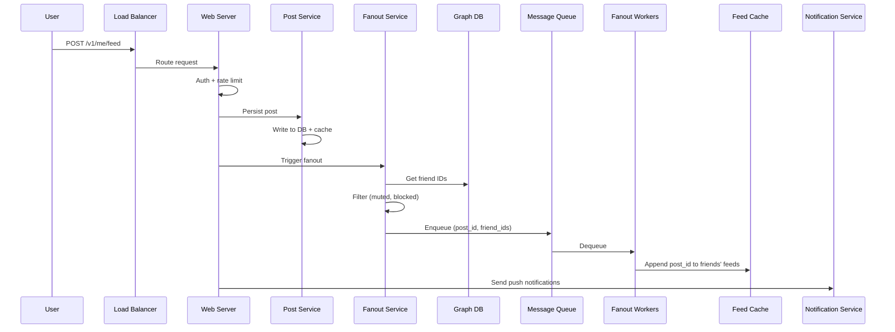

## Summary

The feed publishing flow is the write path of the news feed system. When a user publishes a post, the system must persist the post data, fan it out to all friends' news feed caches, and optionally notify friends of the new content. This involves coordination between the post service (persistence), fanout service (cache population via message queues), and notification service (push alerts).

## How It Works

1. **User** sends `POST /v1/me/feed` with content and auth token.
2. **Web server** authenticates the user and enforces rate limiting (anti-spam).
3. **Post service** persists the post to the database and post cache.
4. **Fanout service** retrieves the user's friend list from the graph database.
5. Friends are **filtered** based on user settings (muted, blocked, visibility preferences).
6. The post ID and filtered friend list are sent to a **message queue**.
7. **Fanout workers** asynchronously append the post ID to each friend's feed in the **news feed cache**.
8. The **notification service** sends push notifications to friends about the new post.

### What the Feed Cache Stores

The feed cache holds `<post_id, user_id>` pairs -- only IDs, not full post objects. This keeps memory usage manageable. A configurable limit (e.g., 500 entries) caps each user's cached feed.

## When to Use

- In any social media or content platform where users create content visible to their connections.
- When fast news feed reads are a priority (pre-compute during write).
- When the write path can tolerate asynchronous processing via message queues.

## Trade-offs

| Advantage | Disadvantage |
|---|---|
| Decouples post persistence from fanout via message queues | Write amplification: one post generates O(friends) cache writes |
| Asynchronous fanout does not block the publish response | Message queue adds slight delay before post appears in friends' feeds |
| Filtered fanout respects user privacy settings | Graph DB lookup + friend filtering adds complexity |
| Post response returns immediately to the user | Fanout workers must scale with total friend count across all publishers |

## Real-World Examples

- **Facebook** persists posts to TAO (graph store) and fans out to friends' feeds via an asynchronous pipeline.
- **Twitter** uses a fanout service that writes to per-user timeline caches in Redis.
- **Instagram** uses a write-time fanout pipeline with special handling for high-follower accounts.

## Common Pitfalls

1. **Synchronous fanout.** If the publish API waits for all friend feeds to be updated before responding, latency becomes unacceptable. Always use async via message queues.
2. **Not filtering friends.** Muted users, blocked users, and visibility settings must be checked during fanout, not just at read time.
3. **Storing full objects in feed cache.** Post objects with text, images, and metadata consume too much memory; store only post IDs.
4. **No rate limiting on publish.** Without publish rate limits, spam accounts can flood friends' feeds.

## See Also

- [[fanout-on-write-vs-read]] -- The push model that this flow implements
- [[newsfeed-retrieval]] -- The corresponding read path that consumes the pre-computed feed
- [[graph-database-social]] -- The graph database queried for friend relationships during fanout
