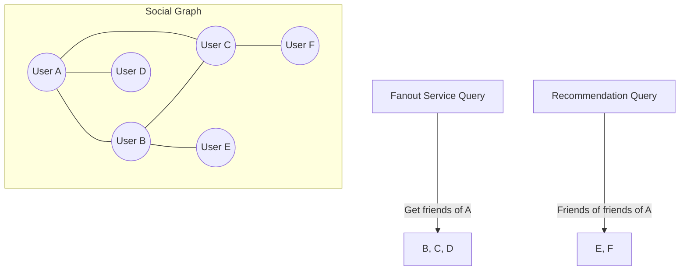

## Summary

A graph database is used to store and query social relationships (friendships, follows) in the news feed system. During fanout, the system needs to quickly retrieve a user's complete friend list. Graph databases are optimized for relationship traversal queries (e.g., "get all friends," "friend-of-friend recommendations") that would require expensive JOIN operations in relational databases. The friend list fetched from the graph database is then used to determine which users' feed caches should receive the new post ID.

## How It Works

1. User relationships are stored as **edges** in the graph database (e.g., User A -- friends_with --> User B).
2. When the fanout service needs a friend list, it queries the graph DB: "Get all nodes connected to User A by a 'friends_with' edge."
3. The query returns the friend list in **O(degree)** time -- proportional to the number of friends, not the total graph size.
4. For **friend recommendations**, the graph DB can efficiently traverse two hops: "friends of friends not yet connected to User A."
5. Results are cached in the **user cache** to avoid repeated graph DB queries.

## When to Use

- When the core data model involves relationships between entities (social networks, organizational hierarchies).
- When queries frequently traverse relationships (friend lists, mutual friends, recommendations).
- When relationship depth matters (2nd-degree connections, shortest path between users).
- In combination with relational databases -- use graph DB for relationships, RDBMS for user profiles and settings.

## Trade-offs

| Advantage | Disadvantage |
|---|---|
| O(degree) friend list retrieval vs O(n) for JOIN in RDBMS | Less mature tooling and ecosystem compared to relational databases |
| Natural model for social relationships and recommendations | Not suitable for non-graph queries (aggregations, analytics) |
| Efficient multi-hop traversals (friend-of-friend) | Horizontal scaling is more complex than key-value stores |
| Schema flexibility for different relationship types | Requires specialized query language (Cypher, Gremlin) |

## Real-World Examples

- **Facebook** uses TAO, a custom graph store, for social graph queries at massive scale.
- **LinkedIn** uses a graph database for its professional network and "People You May Know" recommendations.
- **Neo4j** is a popular open-source graph database used in social networking applications.
- **Twitter** uses FlockDB (now deprecated) and GraphQL-based services for follower/following relationships.

## Common Pitfalls

1. **Using a relational database for all relationship queries.** Self-JOIN on a friend table becomes prohibitively expensive at scale.
2. **Not caching friend lists.** Graph DB queries are fast but still involve network round-trips; cache results in the user cache tier.
3. **Storing too much data in the graph.** Keep the graph focused on relationships; store user profile data in separate relational or document stores.
4. **Ignoring bidirectional relationships.** In a friendship model (unlike follow), ensure both directions are represented and consistent.

## See Also

- [[feed-publishing-flow]] -- Friend lists from the graph DB drive the fanout process
- [[fanout-on-write-vs-read]] -- Friend count from the graph DB determines push vs. pull strategy
- [[cache-architecture]] -- Social graph cache tier stores frequently accessed friend lists
