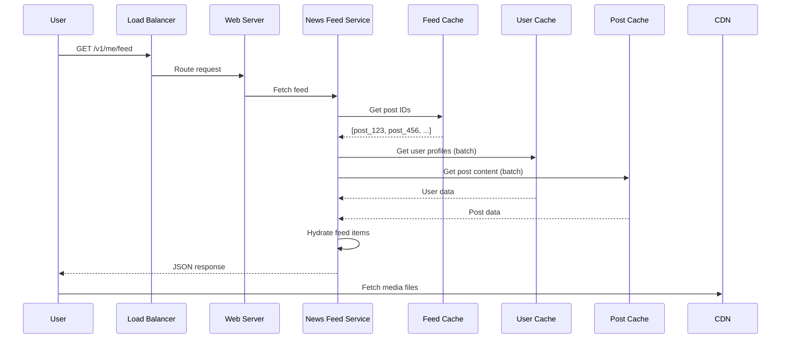

## Summary

News feed retrieval is the read path of the system. When a user opens their feed, the news feed service fetches a list of post IDs from the feed cache (pre-computed during the write path), then **hydrates** those IDs into fully rendered feed items by fetching complete user profiles and post content from separate caches. Media files (images, videos) are served from a CDN for fast delivery.

## How It Works

1. User sends `GET /v1/me/feed`.
2. **News feed service** retrieves a list of **post IDs** from the news feed cache.
3. For each post ID, the service **batch-fetches** the complete post object from the **post cache** and author profile from the **user cache**.
4. The service assembles **fully hydrated feed items** containing username, profile picture, post text, post image URLs, like counts, etc.
5. The response is returned as JSON to the client.
6. The client fetches **media files** (images, videos) directly from the **CDN**.

### Why Hydration?

The feed cache stores only post IDs (8 bytes each) rather than complete post objects (potentially kilobytes each). This dramatically reduces feed cache memory. The trade-off is an additional lookup step at read time, but since user and post caches have very high hit rates for recent content, this is fast in practice.

## When to Use

- In any feed system using the push model where feed caches store IDs only.
- When different data (user profiles, post content, media) have different cache characteristics.
- When media files are large enough to benefit from CDN delivery.

## Trade-offs

| Advantage | Disadvantage |
|---|---|
| Feed cache stays small (IDs only, ~4KB per user for 500 posts) | Hydration requires multiple cache lookups per feed load |
| User and post caches can be scaled independently | Cache miss on popular posts can cause latency spikes |
| Media delivered via CDN, offloading application servers | JSON response assembly adds processing time |
| High cache hit rate for recent content minimizes DB fallback | Stale cache entries may show outdated profile pictures or names |

## Real-World Examples

- **Facebook** hydrates feed items from separate stores for user data, post content, and social signals.
- **Twitter** serves timeline as tweet IDs from Redis, then hydrates with full tweet objects from a separate service.
- **Instagram** fetches feed post IDs from cache, hydrates with user and media metadata, and serves images from their CDN.
- **LinkedIn** uses a similar ID-based feed cache with multi-source hydration for feed rendering.

## Common Pitfalls

1. **Storing full objects in feed cache.** This wastes memory and makes cache updates expensive when a user changes their profile picture.
2. **Sequential hydration.** Fetching user and post data one-by-one is slow; use **batch/parallel** fetches.
3. **No pagination.** Returning the entire feed at once wastes bandwidth; implement cursor-based pagination.
4. **Not pre-warming caches.** After a cache flush, the first few feed loads will be slow; pre-warm with recently active users' data.

## See Also

- [[feed-publishing-flow]] -- The write path that populates the feed cache with post IDs
- [[fanout-on-write-vs-read]] -- Why the feed cache contains pre-computed IDs
- [[cache-architecture]] -- The multi-tier cache design that supports efficient hydration
