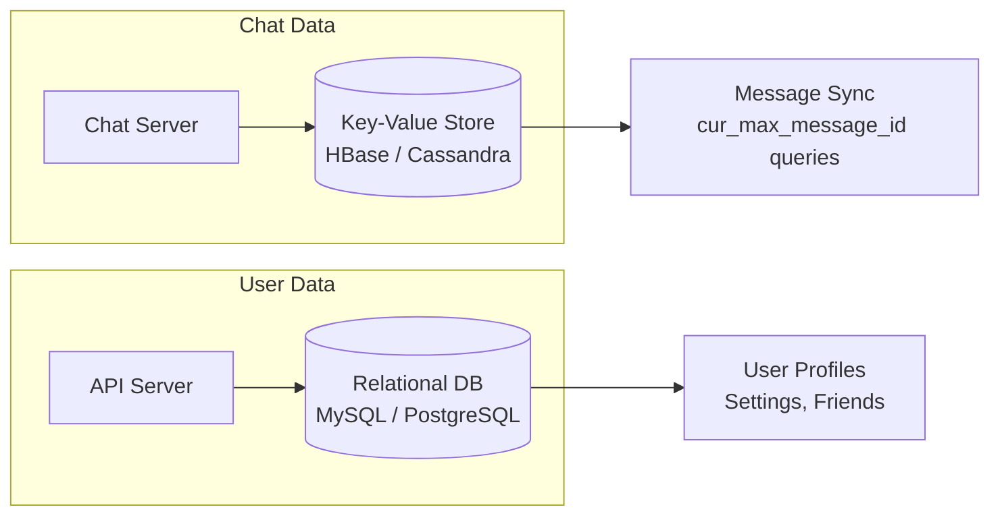

## Summary

Chat systems generate enormous volumes of messages (Facebook Messenger and WhatsApp process 60 billion messages per day). A key-value store (such as HBase or Cassandra) is the recommended storage for chat history because it provides easy horizontal scaling, low-latency access, and efficient handling of the access pattern where recent messages dominate reads while old messages follow a long-tail distribution. Relational databases are used alongside for user profiles and settings, but chat messages live in the KV store.

## How It Works

### Data Model: 1-on-1 Chat
| Column | Type | Notes |
|---|---|---|
| `message_id` | BIGINT | Primary key; time-sortable |
| `from_user_id` | BIGINT | Sender |
| `to_user_id` | BIGINT | Recipient |
| `content` | TEXT | Message body |
| `created_at` | TIMESTAMP | Creation time |

### Data Model: Group Chat
| Column | Type | Notes |
|---|---|---|
| `channel_id` | BIGINT | Partition key |
| `message_id` | BIGINT | Clustering key within partition |
| `from_user_id` | BIGINT | Sender |
| `content` | TEXT | Message body |
| `created_at` | TIMESTAMP | Creation time |

- **1-on-1 chat**: primary key is `message_id`
- **Group chat**: composite primary key is `(channel_id, message_id)` where `channel_id` is the partition key

### Why Key-Value Over Relational?

1. **Horizontal scaling**: KV stores natively shard data across nodes.
2. **Low latency**: Optimized for simple key-based lookups.
3. **Long-tail friendly**: Relational databases struggle when indexes grow large and random access patterns dominate.
4. **Proven at scale**: HBase (Facebook Messenger) and Cassandra (Discord) handle billions of messages.

## When to Use

- For storing chat messages in any messaging application at scale.
- When the access pattern is dominated by recent data with occasional random access to old messages.
- When horizontal scaling is required without the complexity of RDBMS sharding.
- When the read-to-write ratio is approximately 1:1 (unlike read-heavy web applications).

## Trade-offs

| Advantage | Disadvantage |
|---|---|
| Native horizontal scaling across data centers | No SQL-style JOINs; denormalization required |
| Low-latency reads for recent messages | Complex queries (search, aggregation) need separate systems |
| Handles massive write throughput | Eventual consistency model requires careful design |
| Proven at 60B+ messages/day scale | Operational complexity of running HBase/Cassandra clusters |

## Real-World Examples

- **Facebook Messenger** uses HBase for message storage, chosen for its ability to handle massive write loads and efficient range scans.
- **Discord** uses Cassandra to store billions of messages, migrating from MongoDB when it hit scale limits.
- **Slack** uses MySQL with sharding for messages but has explored KV alternatives for hot data.
- **Line** (Japanese messaging app) uses HBase for its chat message store.

## Common Pitfalls

1. **Using a relational database for chat messages.** At scale, JOIN performance degrades and sharding becomes complex.
2. **Not choosing the right partition key.** For group chat, partitioning by `channel_id` keeps all group messages together for efficient range queries.
3. **Ignoring the long tail.** Old messages are rarely accessed but must still be available; configure hot/cold storage tiers.
4. **No compaction strategy.** Both HBase and Cassandra require proper compaction configuration to prevent read amplification from accumulated SSTable files.

## See Also

- [[message-sync]] -- Queries the KV store for messages newer than cur_max_message_id
- [[message-id-generation]] -- IDs used as primary/clustering keys in the KV store
- [[websocket-protocol]] -- Real-time messages are persisted to the KV store before delivery
