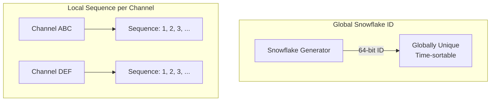

## Summary

In a chat system, message IDs must be **unique** and **time-sortable** (newer messages have higher IDs) to establish message ordering within conversations. Three strategies exist: MySQL auto-increment (simple but unavailable in most NoSQL stores), a **global Snowflake-style ID generator** (unique and time-sortable but complex), and **local sequence numbers per channel** (IDs are unique only within a conversation, but this is sufficient since ordering is only needed within a channel). The local approach is recommended for its simplicity.

## How It Works



### Strategy Comparison

| Strategy | How It Works | Uniqueness Scope |
|---|---|---|
| **Auto-increment** | Database generates sequential IDs | Global (within one DB) |
| **Snowflake** | 64-bit: timestamp + machine ID + sequence | Global (distributed) |
| **Local sequence** | Per-channel counter incremented atomically | Per-channel only |

### Snowflake ID Structure (64 bits)
```
| 1 bit unused | 41 bits timestamp | 5 bits datacenter | 5 bits machine | 12 bits sequence |
```
- **41-bit timestamp**: milliseconds since custom epoch (~69 years of IDs)
- **5-bit datacenter + 5-bit machine**: supports 1024 machines
- **12-bit sequence**: 4096 IDs per millisecond per machine

### Local Sequence
- Each conversation (1-on-1 or group channel) maintains its own counter.
- Counter is incremented atomically when a message is sent within that channel.
- IDs are only unique within their channel -- but ordering is only needed within a channel.
- The composite key `(channel_id, message_id)` is globally unique.

## When to Use

| Strategy | Best For |
|---|---|
| **Auto-increment** | Small-scale systems with a single database |
| **Global Snowflake** | Systems needing globally unique, time-sortable IDs across all channels |
| **Local sequence** | Chat systems where per-channel ordering is sufficient (most common) |

## Trade-offs

| Strategy | Pros | Cons |
|---|---|---|
| **Auto-increment** | Simplest implementation | Single DB bottleneck; unavailable in most NoSQL |
| **Global Snowflake** | Globally unique + time-sortable | Requires distributed coordination; clock skew issues |
| **Local sequence** | Simple; no cross-channel coordination | Not globally unique; requires channel_id as partition key |

## Real-World Examples

- **Twitter** created Snowflake specifically for generating unique, time-sortable tweet IDs at scale.
- **Discord** uses Snowflake-style IDs for messages, channels, and servers.
- **WhatsApp** uses per-conversation sequence numbers for message ordering.
- **Cassandra** supports TimeUUID (Type 1 UUID) which is time-sortable, used by some chat systems as message IDs.

## Common Pitfalls

1. **Using timestamps as IDs.** Two messages sent in the same millisecond would have the same ID; always use a sequence number component.
2. **Clock skew in Snowflake.** If a machine's clock drifts backward, IDs can be out of order; implement clock skew detection and rejection.
3. **Global coordination for local IDs.** If ordering is only needed within a channel, there is no reason to pay the cost of global ID generation.
4. **32-bit IDs.** A 32-bit integer overflows at ~2 billion; use 64-bit IDs for chat systems that store messages forever.

## See Also

- [[chat-storage-kv]] -- Message IDs serve as primary/clustering keys in the KV store
- [[message-sync]] -- The cur_max_message_id sync mechanism depends on monotonically increasing IDs
- [[websocket-protocol]] -- Messages receive their ID before being sent over WebSocket
