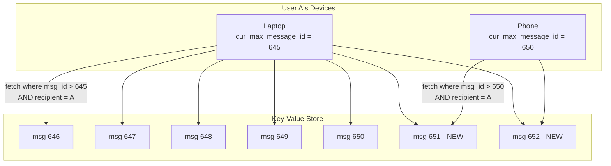

## Summary

Modern chat users access their accounts from multiple devices (phone, laptop, tablet). Each device must see the same conversation history and receive new messages in real time. The system achieves this by having each device maintain a local variable called `cur_max_message_id` that tracks the ID of the latest message it has received. When a device comes online or reconnects, it fetches all messages with IDs greater than its `cur_max_message_id` from the key-value store, ensuring it catches up without re-downloading the entire history.

## How It Works

1. Each device stores `cur_max_message_id` locally (persisted across app restarts).
2. When the device connects (or reconnects), it queries the KV store for messages where:
   - `recipient_id` = the logged-in user
   - `message_id` > the device's `cur_max_message_id`
3. The KV store returns all new messages since the device's last sync point.
4. The device updates its `cur_max_message_id` to the highest received message ID.
5. For **real-time delivery**, the WebSocket connection pushes new messages as they arrive; `cur_max_message_id` is updated on each received message.

## When to Use

- In any multi-device messaging application.
- When users switch between devices frequently (phone during commute, laptop at work).
- When devices may be offline for extended periods and need to catch up.
- In group chats where messages arrive from multiple senders.

## Trade-offs

| Advantage | Disadvantage |
|---|---|
| Simple sync logic -- just compare one ID per device | Requires message IDs to be monotonically increasing |
| Each device syncs independently without coordination | First sync on a new device may pull a large message history |
| No need to track per-device delivery status on the server | If cur_max_message_id is lost (app uninstall), a full re-sync is needed |
| Works for both 1-on-1 and group chats | Does not handle message deletion/edit sync (separate mechanism needed) |

## Real-World Examples

- **WhatsApp** syncs messages across phone and WhatsApp Web using a similar cursor-based approach.
- **Telegram** uses per-device sequence numbers (pts, qts, seq) to track sync state across multiple clients.
- **iMessage** syncs across all Apple devices using a cloud-based message store with per-device read cursors.
- **Slack** uses per-channel event cursors to sync message history across desktop, web, and mobile clients.

## Common Pitfalls

1. **Using timestamps instead of IDs for sync.** Two messages can have the same timestamp; use monotonically increasing IDs for ordering.
2. **Server-side per-device tracking.** Tracking which messages each device has received on the server is complex and unnecessary; let each device track its own cursor.
3. **No pagination on catch-up.** If a device has been offline for weeks, pulling all missed messages at once can overwhelm the client; paginate the catch-up query.
4. **Not persisting cur_max_message_id.** If the app stores it only in memory, a crash loses the sync position and causes redundant re-fetches.

## See Also

- [[websocket-protocol]] -- Real-time delivery path that updates cur_max_message_id
- [[chat-storage-kv]] -- The key-value store queried during sync catch-up
- [[message-id-generation]] -- IDs must be sortable for cursor-based sync to work
