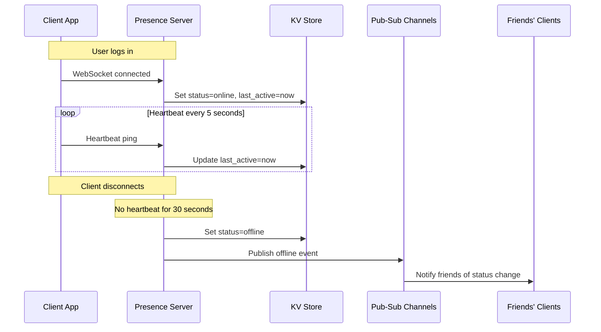

## Summary

Online presence is the feature that shows whether a user is currently online (green dot) or offline. The system uses a **heartbeat mechanism** where connected clients send periodic signals to presence servers. If no heartbeat is received within a threshold (e.g., 30 seconds), the user is marked offline. Status changes are propagated to friends via a **publish-subscribe** model where each friend pair shares a dedicated channel. This approach handles network flakiness gracefully, avoiding rapid online/offline toggling during brief disconnections.

## How It Works

### Status Transitions

| Event | Action |
|---|---|
| **User login** | Set status to online; record `last_active_at` in KV store |
| **Heartbeat received** | Update `last_active_at` timestamp |
| **No heartbeat for X seconds** | Mark user as offline |
| **User logout** | Immediately set status to offline |

### Fanout via Pub-Sub

- Each friend pair has a dedicated channel: User A and User B share channel "A-B."
- When User A's status changes, the event is published to channels A-B, A-C, A-D (one per friend).
- Friends subscribe to their respective channels and receive real-time status updates.
- For **large groups** (100K+ members), fetching status on-demand is more efficient than push.

## When to Use

- In any messaging or social application that displays user online/offline status.
- When real-time status updates are expected by users (chat apps, collaboration tools).
- When the system needs to distinguish between intentional logouts and network disconnections.

## Trade-offs

| Advantage | Disadvantage |
|---|---|
| Handles network flakiness without false offline/online toggling | Heartbeat interval introduces a detection delay (up to X seconds) |
| Pub-sub provides real-time status updates to friends | Per-friend-pair channels scale linearly with friend count |
| Simple heartbeat protocol works over existing WebSocket | Presence server must handle high heartbeat throughput |
| Offline detection is automatic via timeout | For users with thousands of friends, status fanout is expensive |

## Real-World Examples

- **WhatsApp** shows "last seen" timestamps and online indicators using a similar heartbeat approach.
- **Slack** uses presence servers with heartbeat detection and shows green/yellow/away status dots.
- **Discord** maintains real-time presence for millions of users across voice and text channels.
- **WeChat** uses a presence system similar to this design, capped at 500 members per group for status fanout.

## Common Pitfalls

1. **Marking offline on every disconnect.** Brief network interruptions (tunnel, elevator) would cause constant status flapping; the heartbeat timeout absorbs these.
2. **Heartbeat interval too short.** Sending heartbeats every second creates unnecessary server load; 5-10 seconds is typical.
3. **Heartbeat timeout too short.** A timeout of 5 seconds triggers false offlines during minor latency spikes; 30-60 seconds is safer.
4. **Broadcasting status to large groups.** A user with 100K contacts going offline generates 100K events; use on-demand presence queries for large groups instead.

## See Also

- [[websocket-protocol]] -- The persistent connection over which heartbeats are sent
- [[service-discovery]] -- Presence servers work with service discovery to track user-server assignments
- [[message-sync]] -- Online presence affects whether messages are pushed in real-time or queued for later
