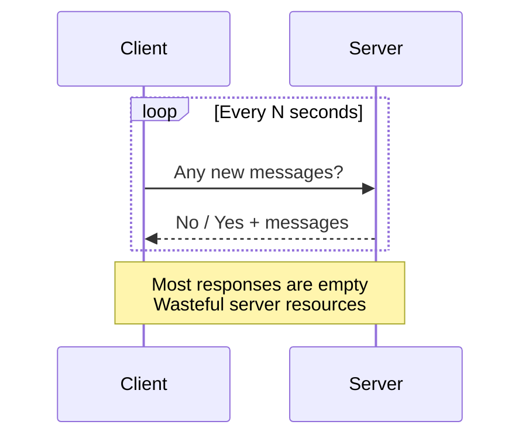
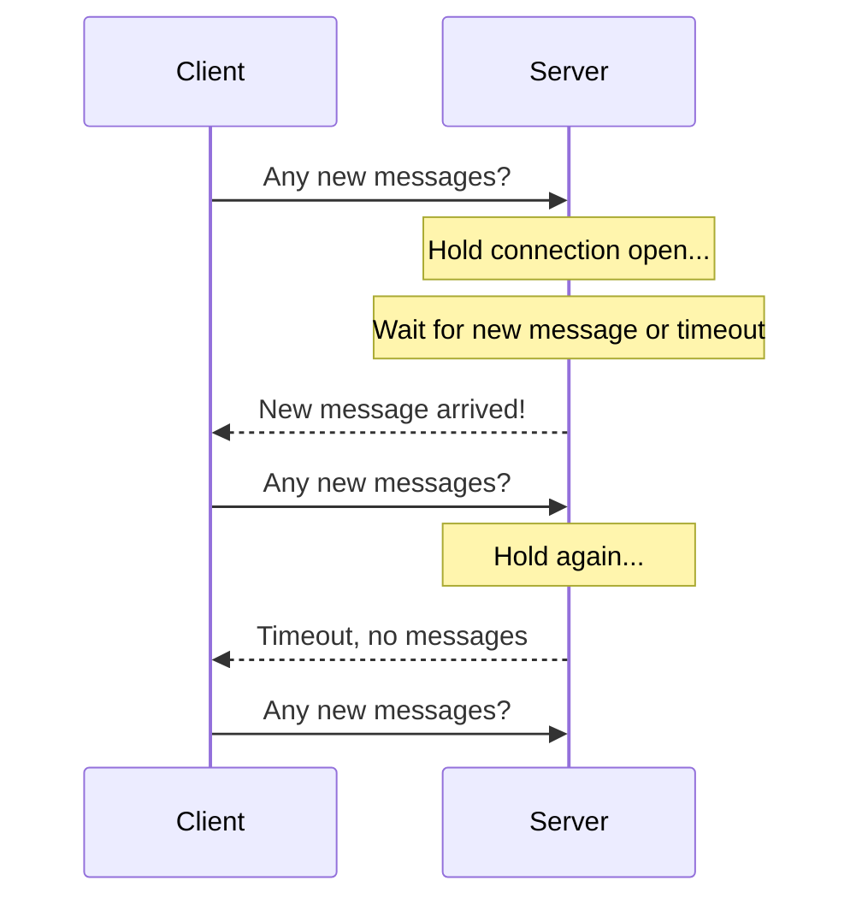

## Summary

Before WebSocket became the standard for real-time communication, two HTTP-based techniques were used to simulate server-to-client message delivery: **polling** (client periodically asks the server for new data) and **long polling** (client holds an open connection until data arrives or a timeout occurs). Both have significant drawbacks that make them inferior to WebSocket for chat systems, but understanding them is important for system design interviews.

## How It Works

### Polling

1. The client sends HTTP requests at a **fixed interval** (e.g., every 3 seconds).
2. The server responds immediately -- either with new messages or an empty response.
3. Most responses contain no new data, wasting server resources and bandwidth.

### Long Polling

1. The client sends an HTTP request.
2. The server **holds the connection open** until either new data is available or a **timeout** is reached.
3. When data arrives, the server responds and the client immediately sends a new request.
4. Reduces empty responses compared to polling, but still has significant limitations.

## When to Use

| Technique | Appropriate When |
|---|---|
| **Polling** | Very simple systems with low real-time requirements; legacy browser support |
| **Long Polling** | When WebSocket is unavailable (proxy/firewall restrictions); as a fallback |
| **Neither** | For any modern chat system -- use WebSocket instead |

## Trade-offs

| Aspect | Polling | Long Polling | WebSocket |
|---|---|---|---|
| Server load | High (constant requests) | Medium (fewer requests) | Low (persistent connection) |
| Latency | Up to polling interval | Near real-time | Real-time |
| Empty responses | Many | Fewer | None |
| Sender/receiver mismatch | No | Yes (stateless routing issue) | No (persistent) |
| Disconnect detection | Immediate (no response) | Unreliable | Via heartbeat |
| Complexity | Simple | Moderate | Moderate |

## Real-World Examples

- **Early Gmail** used long polling (BOSH protocol) for real-time email notifications before switching to WebSocket-based approaches.
- **CometD** is a framework that implements long polling as a fallback when WebSocket is unavailable.
- **Socket.IO** starts with long polling and automatically upgrades to WebSocket when supported, demonstrating the fallback pattern.
- **AJAX-based chat apps** from the 2000s era used short polling intervals.

## Common Pitfalls

1. **Choosing polling for a chat system.** The vast majority of poll responses contain no data, wasting server resources at scale.
2. **Ignoring the sender/receiver server mismatch.** With long polling and stateless load balancing, the server holding User A's connection may not be the one that received User B's message.
3. **Setting long polling timeout too long.** Some proxies and load balancers close idle connections; a timeout of 30-60 seconds is typical.
4. **Not implementing WebSocket fallback.** Even if WebSocket is preferred, having long polling as a fallback ensures connectivity in restrictive network environments.

## See Also

- [[websocket-protocol]] -- The modern replacement for polling and long polling
- [[service-discovery]] -- Addresses the server mismatch problem that plagues long polling
- [[message-sync]] -- Message synchronization mechanisms that work with any transport
