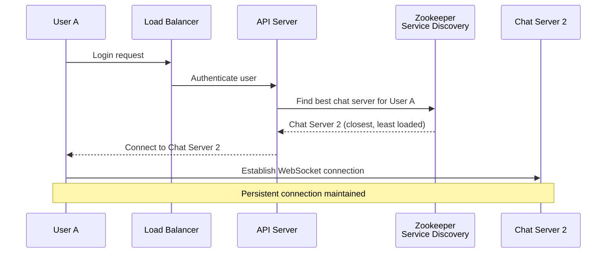

## Summary

In a chat system, the chat service is **stateful** -- each client maintains a persistent WebSocket connection to a specific chat server. Unlike stateless HTTP services that can be load-balanced with round-robin, stateful connections require intelligent server assignment. Service discovery (commonly implemented with Apache Zookeeper) recommends the best chat server for each client based on geographic location, server capacity, and current load, and tracks which clients are connected to which servers.

## How It Works

1. User sends a **login request** through the load balancer to API servers (stateless HTTP).
2. After authentication, the API server queries **Zookeeper** to find the optimal chat server.
3. Zookeeper maintains a **registry of all available chat servers** with their current load, location, and health status.
4. Based on predefined criteria (geographic proximity, server capacity, number of existing connections), Zookeeper **recommends a chat server**.
5. The server info is returned to the client, which then establishes a **direct WebSocket connection** to that chat server.
6. The client **stays connected** to this server as long as it is available (no random rebalancing).

### What Zookeeper Tracks

- List of all chat server instances and their health status
- Current connection count per server
- Geographic region of each server
- Server capacity and resource utilization

## When to Use

- In any system with stateful, persistent connections where clients must be assigned to specific servers.
- When chat servers are distributed across multiple regions and clients should connect to nearby servers.
- When server load must be balanced dynamically as users connect and disconnect.
- When servers can fail and clients need to be reassigned automatically.

## Trade-offs

| Advantage | Disadvantage |
|---|---|
| Intelligent server assignment based on multiple criteria | Adds a dependency on Zookeeper (additional infrastructure) |
| Automatic detection and removal of failed servers | Zookeeper itself can become a bottleneck if not clustered |
| Geographic-aware routing reduces latency | Client reconnection requires another service discovery lookup |
| Dynamic load balancing as servers scale up/down | Consistency of server registry requires consensus protocol overhead |

## Real-World Examples

- **Discord** uses a custom service discovery mechanism to assign users to voice and chat servers based on region.
- **WhatsApp** uses Erlang-based service discovery for routing messages between chat server nodes.
- **Apache Zookeeper** is used by LinkedIn, Pinterest, and many other companies for service discovery.
- **etcd** and **Consul** are alternative service discovery systems that provide similar functionality.

## Common Pitfalls

1. **Using round-robin for stateful connections.** Unlike HTTP requests, WebSocket connections are long-lived; round-robin does not account for connection duration or server load.
2. **Single Zookeeper node.** Zookeeper must be deployed as a cluster (typically 3 or 5 nodes) for high availability.
3. **Not handling server failures.** When a chat server goes down, all its connected clients must be reassigned to new servers via service discovery.
4. **Sticky sessions instead of service discovery.** Cookie-based sticky sessions work for HTTP but not for WebSocket connections that need intelligent initial assignment.

## See Also

- [[websocket-protocol]] -- The persistent connections that service discovery manages
- [[online-presence]] -- Presence servers coordinate with service discovery to track user locations
- [[chat-storage-kv]] -- Chat servers discovered via Zookeeper write to the shared KV store
