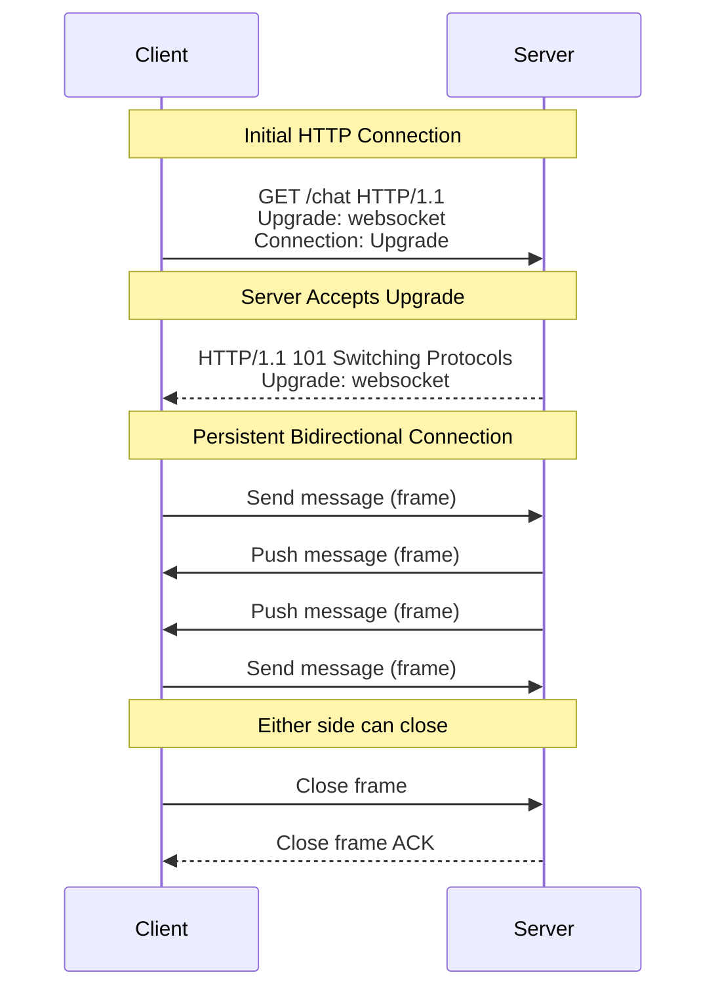

## Summary

WebSocket is a bidirectional, persistent communication protocol that enables real-time data exchange between clients and servers. It begins as an HTTP connection and is "upgraded" via a handshake to a full-duplex WebSocket connection. For chat systems, WebSocket is the preferred protocol because it allows the server to push messages to clients instantly without the overhead of polling. It uses ports 80/443 (same as HTTP/HTTPS), so it generally works through firewalls.

## How It Works

1. The client sends an HTTP request with `Upgrade: websocket` header.
2. The server responds with **101 Switching Protocols**, establishing the WebSocket connection.
3. Both sides can now send **frames** (messages) at any time -- truly bidirectional.
4. The connection stays open until explicitly closed by either side or due to network failure.
5. On the sender side, HTTP could be used for sending messages (stateless), but using WebSocket for both directions simplifies the architecture.

## When to Use

- Real-time messaging applications (chat, collaboration tools).
- Live notifications and activity feeds.
- Multiplayer games requiring low-latency updates.
- Financial trading platforms with real-time price updates.
- Any application where the server needs to push updates to clients without polling.

## Trade-offs

| Advantage | Disadvantage |
|---|---|
| True bidirectional communication | Persistent connections consume server memory |
| Low latency -- no polling overhead | Requires careful connection management at scale |
| Works through most firewalls (ports 80/443) | Stateful -- harder to load balance than HTTP |
| Efficient for frequent small messages | Not suitable for infrequent, large data transfers |
| Single connection for both send and receive | Connection recovery needed after network interruptions |

## Real-World Examples

- **Slack** uses WebSocket for real-time message delivery and presence updates.
- **Discord** uses WebSocket (and WebRTC for voice) for real-time chat with millions of concurrent users.
- **WhatsApp Web** uses WebSocket to sync messages between the phone and browser.
- **Facebook Messenger** initially used HTTP for sending but WebSocket for receiving; modern implementations use WebSocket for both.

## Common Pitfalls

1. **Not handling reconnection.** Network interruptions are common, especially on mobile; implement automatic reconnection with exponential backoff.
2. **Using WebSocket for everything.** Stateless operations (login, profile updates) should still use HTTP; only real-time messaging needs WebSocket.
3. **Ignoring connection limits.** Each open WebSocket connection uses ~10KB of server memory; plan server capacity accordingly.
4. **No heartbeat/ping-pong.** Without periodic pings, the server cannot detect silently disconnected clients (e.g., user closed laptop lid).

## See Also

- [[polling-long-polling]] -- The predecessor approaches that WebSocket replaced
- [[service-discovery]] -- Assigns clients to specific WebSocket servers
- [[online-presence]] -- Uses the WebSocket connection for heartbeat-based presence
