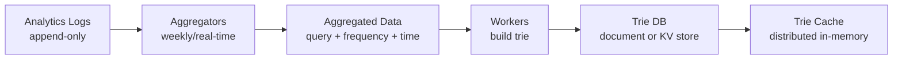

## Summary

The **data gathering service** is the offline write path that collects raw search query logs, aggregates them into frequency tables, and rebuilds the trie periodically. It decouples the write-heavy analytics workload from the read-heavy query service, allowing the query path to remain fast and simple. The pipeline consists of analytics logs, aggregators, workers, a trie database, and a trie cache.

## How It Works

### Pipeline stages

| Stage | Description |
|-------|-------------|
| **Analytics Logs** | Raw, append-only logs of every search query with timestamp |
| **Aggregators** | Summarize logs into (query, frequency) pairs over a time window (e.g., weekly) |
| **Workers** | Asynchronous servers that build a new trie from aggregated data |
| **Trie DB** | Persistent store -- either a document store (MongoDB for serialized trie) or a key-value store (prefix as key, node data as value) |
| **Trie Cache** | Distributed in-memory cache (e.g., Redis cluster) that takes weekly snapshots from DB |

### Aggregation frequency

| Use Case | Aggregation Window | Example |
|----------|-------------------|---------|
| General search (Google) | Weekly | Stable query patterns |
| Real-time (Twitter) | Minutes to hours | Trending topics matter |
| E-commerce (Amazon) | Daily | Seasonal product searches |

## When to Use

- When the query index (trie) does not need to reflect every single query in real-time
- When log volumes are too large for real-time trie mutation (billions of queries per day)
- When you need a clean separation between the analytics/write path and the serving/read path

## Trade-offs

| Advantage | Disadvantage |
|-----------|-------------|
| Decouples write load from read path | Suggestions can be stale until next rebuild |
| Batch processing is simpler and more efficient | Infrastructure complexity (logs + aggregators + workers) |
| Can tune aggregation window per use case | Real-time trending requires a separate fast path |
| Workers can rebuild without affecting live traffic | Full trie rebuild is expensive for very large datasets |

## Real-World Examples

- **Google Search** aggregates query logs offline and updates autocomplete indexes periodically
- **Facebook Typeahead** uses analytics pipelines to build prefix indexes
- **Elasticsearch** uses index refresh intervals to batch-update suggestion indexes
- **Apache Kafka + Spark** are commonly used to build real-time aggregation pipelines for trending queries

## Common Pitfalls

- **Updating the trie in real-time on every query**: This creates a write bottleneck on the query service and is impractical at billions of queries/day
- **Not sampling high-volume logs**: Without data sampling (e.g., 1-in-N), log storage and processing become prohibitively expensive
- **Single aggregation window for all use cases**: Real-time apps (Twitter) and stable apps (Google Search) need different windows
- **No rollback strategy**: If a bad trie build is deployed, you need the ability to quickly revert to the previous version

## See Also

- [[trie-data-structure]]
- [[top-k-caching-in-trie]]
- [[query-service]]
- [[trie-sharding]]
