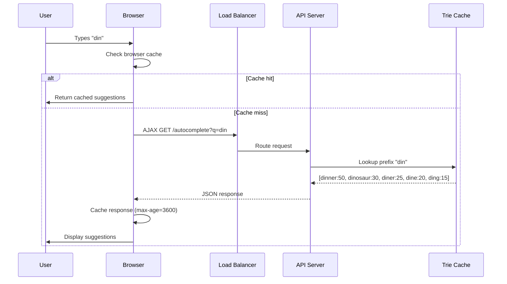

## Summary

The **query service** is the read path that returns the top-k autocomplete suggestions for a given prefix. Requests flow through a load balancer to stateless API servers that look up results in a distributed **trie cache**. The service must respond in under 100 ms to avoid UI stuttering. Client-side optimizations (AJAX, browser caching) and server-side optimizations (data sampling) further reduce latency and load.

## How It Works

### Three layers of optimization

| Layer | Optimization | Benefit |
|-------|-------------|---------|
| **Client** | AJAX requests | No full-page refresh on each keystroke |
| **Client** | Browser caching (max-age=3600) | Subsequent requests for same prefix served locally |
| **Server** | Data sampling (1-in-N logging) | Reduces log volume and processing cost |

### Cache miss handling
If data is not in the trie cache (cache miss due to eviction or server restart), the API server fetches from the trie DB and replenishes the cache. Subsequent requests for the same prefix then hit the cache.

## When to Use

- Any **prefix-based suggestion** system requiring sub-100ms latency
- Systems where the index changes infrequently (read-heavy, write-infrequent)
- When clients can tolerate slightly stale suggestions (hourly or daily freshness)

## Trade-offs

| Advantage | Disadvantage |
|-----------|-------------|
| Sub-100ms response via in-memory cache | Cache requires significant memory |
| Stateless API servers scale horizontally | Cache miss path adds latency (DB lookup) |
| Browser caching reduces server load | Stale client-side cache for up to 1 hour |
| AJAX avoids page refreshes | Every keystroke still generates a request (unless debounced) |
| Data sampling reduces log cost | Sampled data may miss low-frequency queries |

## Real-World Examples

- **Google Search** uses browser caching with `Cache-Control: private, max-age=3600` for autocomplete responses
- **Facebook Typeahead** serves suggestions from an in-memory index with sub-50ms p99 latency
- **Algolia Search** provides autocomplete APIs with edge caching and client-side debouncing
- **Slack** uses prefix search with in-memory indexes for channel/user/message autocomplete

## Common Pitfalls

- **Not using AJAX**: Full page refreshes on each keystroke create terrible UX and waste bandwidth
- **No browser cache**: Without client-side caching, repeated prefixes hit the server unnecessarily
- **Logging every query**: At 10M DAU with 20 requests per search, that is 2 billion log entries/day; use sampling
- **Not debouncing client requests**: Firing a request on every keystroke (even with AJAX) creates unnecessary load; debounce with a 100-200ms delay
- **Ignoring cache warming**: After a trie rebuild, the cache is cold; pre-warm with popular prefixes

## See Also

- [[trie-data-structure]]
- [[top-k-caching-in-trie]]
- [[data-gathering-service]]
- [[trie-sharding]]
